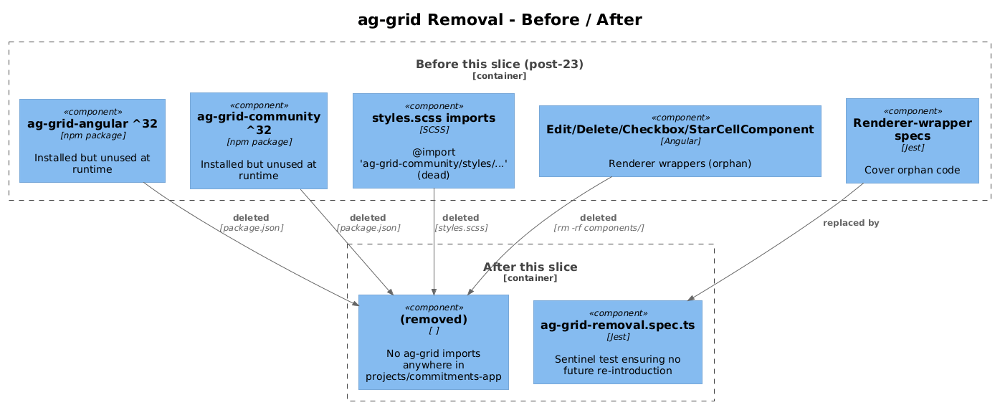
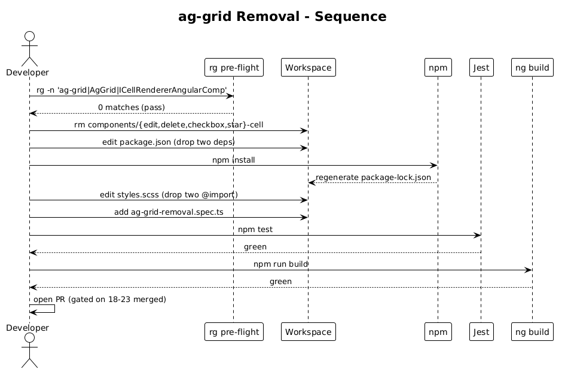

# Ag-Grid Package Removal — Detailed Design

**Status:** Draft

**Traces to:** Internal cleanup — no L1/L2 surface change. Closes the migration arc started by deltas 18 — 23.

## 1. Overview

Once every consumer in deltas 18 — 23 has flipped to `<app-data-table>`, the `ag-grid-angular` and `ag-grid-community` packages — and the four ag-grid-only renderer wrappers — become dead code. This slice deletes them.

It is intentionally the **last** slice in the arc so that the build stays green throughout the migration: ag-grid stays installed and the global stylesheet still imports its CSS until the very last consumer has flipped.

**Actors:** none — pure refactor.

**Scope boundary:** dependency removal, dead-code deletion, smoke verification. No runtime behaviour change.

## 2. Architecture

### 2.1 C4 Component


The diagram contrasts the dependency closure before and after this slice — five removed pieces (two npm packages, four renderer wrappers, two CSS imports) and zero additions.

## 3. Component Details

### 3.1 Pre-flight check (mandatory)

Before any deletion, the slice **must** verify there are no remaining references. Run the following against the working copy and assert zero matches:

```bash
# Must return zero hits
rg -nP "ag-grid|AgGrid|frameworkComponents|ICellRendererAngularComp" \
   frontend/projects \
   --glob '!**/*.png' --glob '!docs/**'
```

If any match remains, the corresponding consumer was missed in deltas 18 — 23 and must be migrated before this slice proceeds.

### 3.2 Renderer wrapper deletion

Delete the entire files (and their `.html` / `.scss` siblings):

- `frontend/projects/commitments-app/src/app/components/edit-cell/edit-cell.component.{ts,html,scss}`
- `frontend/projects/commitments-app/src/app/components/delete-cell/delete-cell.component.{ts,html,scss}`
- `frontend/projects/commitments-app/src/app/components/checkbox-cell/checkbox-cell.component.{ts,html,scss}`
- `frontend/projects/commitments-app/src/app/components/star-cell/star-cell.component.{ts,html,scss}`

Plus their existing Jest specs (`*.spec.ts`) — the smoke spec in §3.5 covers the regression surface for the replacement templates.

The `StarCellComponent` was unused by any current page (it appeared in the import inventory but no `frameworkComponents` registry referenced it). It is deleted along with the others to leave no lingering ag-grid types in `commitments-app`.

### 3.3 npm dependency removal

`frontend/package.json`:

```diff
   "dependencies": {
     ...
-    "ag-grid-angular": "^32.0.0",
-    "ag-grid-community": "^32.0.0",
     "angular-gridster2": "^21.0.1",
     ...
   }
```

Run `npm install` (or `npm prune`) so `package-lock.json` is regenerated. The PR includes the regenerated lockfile.

### 3.4 Global stylesheet cleanup

`frontend/projects/commitments-app/src/styles.scss`:

```diff
- // AG Grid styles - updated for AG Grid 32
- @import 'ag-grid-community/styles/ag-grid.css';
- @import 'ag-grid-community/styles/ag-theme-material.css';
```

No replacement needed — `MatTableModule` styling is provided by the existing Material theme imported via `@use './styles/theme.scss'`.

### 3.5 Smoke spec

Add a single Jest spec at `frontend/projects/commitments-app/src/app/ag-grid-removal.spec.ts` (a sentinel test that future code reviews will see):

```ts
describe('ag-grid removal', () => {
  it('contains no ag-grid imports anywhere in commitments-app', async () => {
    // Use jest's @ts-ignore-friendly require with a glob — or hand-roll a fs.readdirSync walk.
    const files = await glob('projects/commitments-app/src/**/*.ts');
    const offenders = files.filter(f =>
      /from ['"]ag-grid-(angular|community)['"]/.test(fs.readFileSync(f, 'utf8'))
    );
    expect(offenders).toEqual([]);
  });
});
```

The spec is a **belt-and-braces** check: even if a future commit accidentally re-introduces an ag-grid import, the test fails before it lands.

### 3.6 Documentation update

Cross out the migration arc by setting designs 18 — 23 status to `Implemented` in `docs/detailed-designs/00-index.md` once each PR merges. This slice is the last to flip, after all six prior PRs are merged.

## 4. Data Model

No data model. Nothing in `*.cs`, `*.csproj`, or any database touches this slice.

## 5. Key Workflows

### 5.1 Removal sequence


1. Pre-flight rg verification.
2. Delete renderer-wrapper folders.
3. Edit `package.json` to drop `ag-grid-angular` and `ag-grid-community`.
4. Run `npm install`; commit `package-lock.json`.
5. Delete the two `@import` lines from `styles.scss`.
6. Add the smoke spec.
7. Run the full Jest suite + `ng build` end-to-end. Both must pass.

## 6. API Contracts

None.

## 7. Security Considerations

- Removing two npm packages **shrinks** the dependency surface (and therefore the supply-chain attack surface). No new code is introduced.
- The smoke spec deliberately runs in the test environment, not in production code paths, so it has no runtime cost.

## 8. ATDD Slices

1. **Single PR**, gated on:
   - Every preceding migration PR (deltas 18 — 23) merged to `main`.
   - Pre-flight `rg` returns zero hits in CI.
   - Full Jest suite green, full `ng build` green, full Playwright suite (`npm run e2e:chromium`) green.

## 9. Open Questions

- **Bundle-size measurement**: capture an `ng build --stats-json` before and after this PR — useful evidence for the changelog. Recommend including the delta in the PR description but not gating the merge on a specific number.
- **ESLint rule**: optional follow-up — add `'no-restricted-imports': ['error', { paths: [{ name: 'ag-grid-angular' }, { name: 'ag-grid-community' }] }]` to make the smoke spec redundant. Defer; the spec is sufficient.
