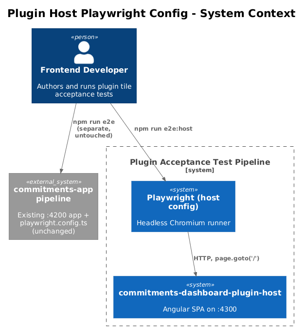
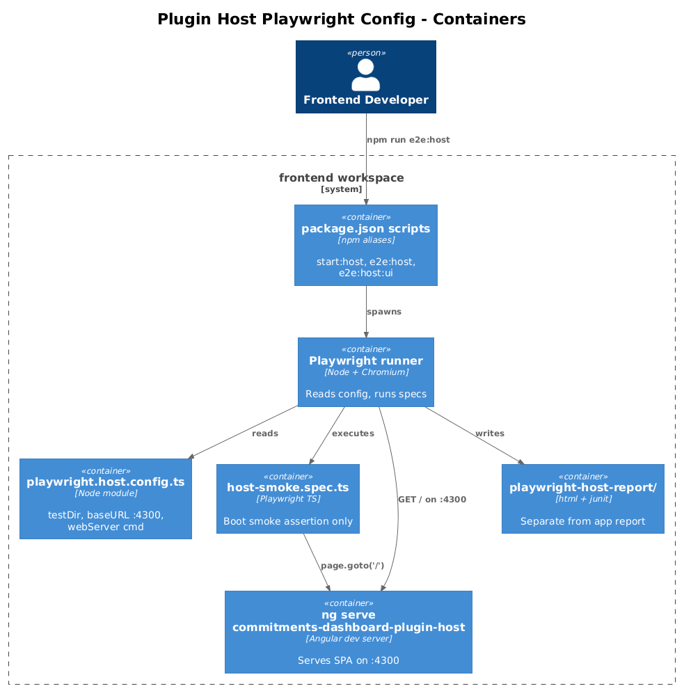
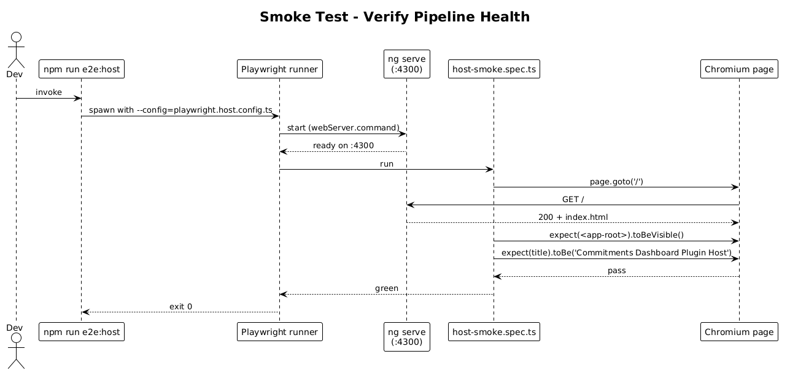

# Plugin Host Playwright Config — Detailed Design

## 1. Overview

Goal: stand up a **second** Playwright test pipeline that targets `commitments-dashboard-plugin-host` so plugin tiles can be acceptance-tested in isolation, without exercising any of `commitments-app` (the real product surface).

This slice is the foundation. It does not change a single line of host, plugin, or framework code. It only adds:

1. A new Playwright config file rooted at the host's `e2e/` folder, serving the host on port `4300`.
2. NPM scripts (`e2e:host`, `e2e:host:ui`).
3. A single smoke spec proving the host boots and the new pipeline is wired.

Once this slice ships, every later slice (26-32) can lean on `npm run e2e:host` to verify its own work end-to-end. Without this slice, the harness route and bridge are unverified Angular code with no test runner pointed at them.

**Source of intent:** [`docs/commitments-dashboard-plugin-acceptance-testing-via-host.md`](../../commitments-dashboard-plugin-acceptance-testing-via-host.md) and [`docs/pllug in testing.drawio`](../../pllug%20in%20testing.drawio) — both call for Playwright running against the host.

**Scope boundary:** this slice owns *only* the harness for the host. The existing `playwright.config.ts` (which targets `commitments-app/e2e`) is untouched.

## 2. Architecture

### 2.1 C4 Context Diagram



### 2.2 C4 Container Diagram



### 2.3 Smoke-Test Sequence



## 3. Component Details

### 3.1 `playwright.host.config.ts`
- **Responsibility:** drive Playwright for the host app on port `4300`.
- **Location:** `frontend/playwright.host.config.ts` (sibling of the existing `playwright.config.ts`).
- **Key settings:**
  - `testDir: './projects/commitments-dashboard-plugin-host/e2e'`
  - `use.baseURL: 'http://127.0.0.1:4300'`
  - `webServer.command: 'npm run start:host -- --host 127.0.0.1 --port 4300'`
  - `webServer.url: 'http://127.0.0.1:4300'`
  - `projects`: only `lg-desktop` (`1280x800`) for slice 25 — extra viewports come later if needed. Radically simple: one viewport.
  - `workers`: `1` in CI, `1` locally. Single worker keeps Angular's dev-server stable (mirrors the bug-062 cap from the app config).
  - `retries`: `2` in CI, `0` locally.
  - `reporter`: `[['html'], ['junit', { outputFile: 'test-results/host-junit.xml' }]]`. Output dir is `frontend/playwright-host-report/` (separate from the app's `playwright-report/`).
- **No fancy config:** no auth fixtures, no global setup, no custom reporters beyond html+junit.

### 3.2 NPM scripts in `frontend/package.json`
- **Responsibility:** invocation aliases.
- **Adds:**
  - `start:host`: `ng serve commitments-dashboard-plugin-host`
  - `e2e:host`: `playwright test --config=playwright.host.config.ts`
  - `e2e:host:ui`: `playwright test --config=playwright.host.config.ts --ui`
  - `e2e:host:report`: `playwright show-report playwright-host-report`
- The existing `e2e`, `e2e:ui` scripts continue to use the default `playwright.config.ts` and target the app — unchanged.

### 3.3 Smoke spec
- **Location:** `projects/commitments-dashboard-plugin-host/e2e/host-smoke.spec.ts`
- **Responsibility:** prove the runner + webServer wiring is correct.
- **What it asserts:**
  1. `page.goto('/')` returns HTTP 200 and renders a non-empty `<app-root>`.
  2. The page title matches `'Commitments Dashboard Plugin Host'` (already in `index.html`).
- **What it does *not* assert:** anything about tiles, dashboard chrome, or framework behavior. Tile assertions arrive in slice 26+. The spec exists so a green run proves the *pipeline* itself is healthy.

## 4. Data Model

No new data. No DB. No API. No state.

## 5. Key Workflows

### 5.1 Local developer runs `npm run e2e:host`
1. Playwright reads `playwright.host.config.ts`.
2. `webServer` boots `ng serve commitments-dashboard-plugin-host` on `127.0.0.1:4300` (with the existing host bootstrap from slice 0). Reuses an existing dev server if one is already up.
3. The smoke spec runs headless against the served host.
4. HTML report is written to `playwright-host-report/`.

### 5.2 CI run (future job)
Same flow, but `process.env.CI` triggers `retries: 2` and `workers: 1`. The CI job is *not* added in this slice — only the config that supports it. Wiring CI is a follow-up.

## 6. File Plan

```
frontend/
├── playwright.host.config.ts                    ← NEW
├── package.json                                 ← MODIFIED (4 new scripts)
├── playwright-host-report/                      ← generated (gitignored)
└── projects/commitments-dashboard-plugin-host/
    └── e2e/
        └── host-smoke.spec.ts                   ← NEW
```

`.gitignore` updates: `playwright-host-report/` and `test-results/host-*`. Both follow the existing patterns for the app pipeline.

## 7. Open Questions

1. **Port `4300`** — is there any other dev tool already bound to `4300`? The app uses `4200`; storybook uses `6006`. `4300` looks free, but a developer with a local docker stack should confirm.
2. **CI integration** — should `e2e:host` run on every PR, or only on PRs that touch `commitments-dashboard-plugin/**` or `commitments-dashboard-plugin-host/**`? Path-filtering keeps CI fast but risks missing framework-side regressions. Recommendation: run on every PR once the suite is small and stable; revisit if total runtime crosses 5 min.
3. **Trace / screenshot policy** — current proposal mirrors the app config (`trace: 'on-first-retry'`, `screenshot: 'only-on-failure'`). Ship as-is unless the team wants `trace: 'retain-on-failure'` for richer post-mortems.

## 8. Out of Scope

- Tile harness route (slice 26).
- Window bridge (slice 27).
- HTTP/Chart recorders (slices 28, 29).
- Per-tile specs (slices 30-32).
