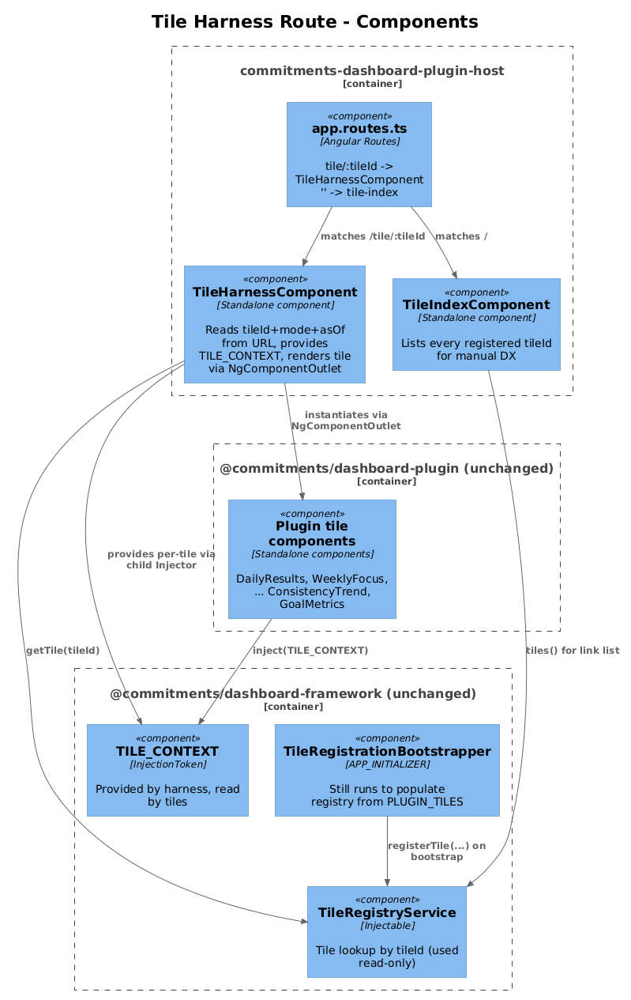
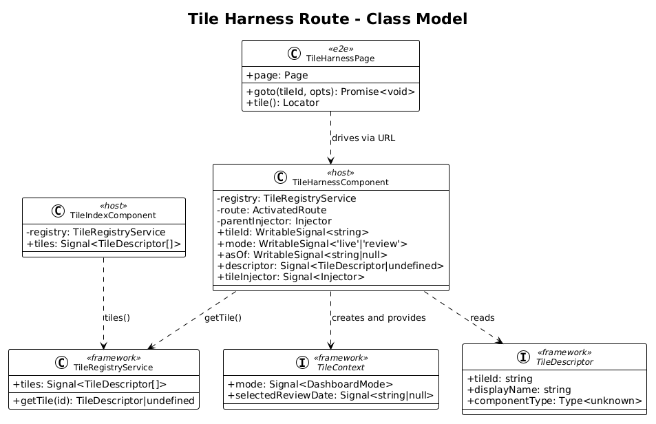
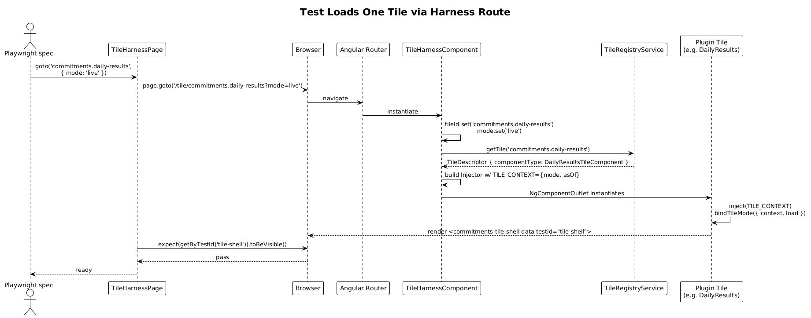

# Tile Harness Route — Detailed Design

**Status:** Complete

## 1. Overview

Goal: render any plugin tile in isolation under `/tile/:tileId` in the plugin host, without going through `DashboardShellComponent`, `DashboardGridComponent`, `AddTileDialogComponent`, or any other dashboard chrome. The plugin tile is the System Under Test; everything else is replaced by the radically-simple `TileHarnessComponent`.

This is the **central** slice of the acceptance-testing arc — the visual idea from [`docs/pllug in testing.drawio`](../../pllug%20in%20testing.drawio):

> Playwright → Browser → Network Layer → **plugin host app** → **mock dashboard framework** → **commitments dashboard plugin** → window bridge

The "mock dashboard framework" in that diagram is, in radically-simple form, **just bypassing the framework chrome** and providing the plugin tile's only runtime dependency on the framework — the `TILE_CONTEXT` token — directly from the harness. No `DashboardShellComponent` is rendered. No `DashboardLayoutStore` is hydrated. No `add-tile-dialog` is opened. The framework's `TileRegistryService` (which is itself stateless and read-only) is reused unmodified to look up the tile by id.

**Plugin code is not modified by this slice.** The plugin's tile components, controllers, and metadata are exercised exactly as they are.

**Source of intent:**
- `commitments-dashboard-plugin-acceptance-testing-via-host.md`: "each tile can be rendered and tested in commitments-dashboard-plugin-host" + "a mock of the dashboard-framework interface shall be mocked … so that the playwright tests do not exercise dashboard-framework code".
- `pllug in testing.drawio`: shows the plugin nested inside the host with the framework mocked away.

**Scope boundary:** this slice owns the harness route, the harness component, and a single Playwright POM that navigates to it and asserts a tile renders. Bridge, HTTP recording, chart recording, and per-tile specs are downstream slices.

## 2. Architecture

### 2.1 C4 Component Diagram



### 2.2 Class Diagram



### 2.3 Tile-Load Sequence



## 3. Component Details

### 3.1 `TileHarnessComponent`
- **Location:** `projects/commitments-dashboard-plugin-host/src/app/harness/tile-harness.component.ts`
- **Responsibility:** read `tileId` from the route param, look up the tile descriptor from `TileRegistryService`, build a `TileContext` from query params, and render the tile component via `<ng-container *ngComponentOutlet>` with a child injector that provides `TILE_CONTEXT`.
- **Template:**
  ```html
  @if (descriptor()) {
    <ng-container *ngComponentOutlet="descriptor()!.componentType; injector: tileInjector()" />
  } @else {
    <p data-testid="tile-not-found">Unknown tile: {{ tileId() }}</p>
  }
  ```
- **Inputs:** none. Reads `tileId` and query params via `ActivatedRoute` + Angular's input-from-route binding (`withComponentInputBinding`).
- **Dependencies:** `TileRegistryService` (read-only), `ActivatedRoute`, parent `Injector`.
- **Behavior on bad input:**
  - Unknown `tileId`: render the `tile-not-found` testid block. No throw.
  - Mode value other than `live` / `review`: defaults to `live`. (Same defaulting as `DashboardModeService`.)
- **Key logic** (~30 lines TS):
  ```ts
  export class TileHarnessComponent {
    private readonly registry = inject(TileRegistryService);
    private readonly route = inject(ActivatedRoute);
    private readonly parentInjector = inject(Injector);

    readonly tileId = signal<string>('');
    readonly mode = signal<DashboardMode>('live');
    readonly asOf = signal<string | null>(null);

    readonly descriptor = computed(() => this.registry.getTile(this.tileId()));

    readonly tileInjector = computed(() => {
      const ctx: TileContext = {
        mode: this.mode,
        selectedReviewDate: this.asOf
      };
      return Injector.create({
        parent: this.parentInjector,
        providers: [{ provide: TILE_CONTEXT, useValue: ctx }]
      });
    });

    constructor() {
      this.route.paramMap.subscribe((p) => this.tileId.set(p.get('tileId') ?? ''));
      this.route.queryParamMap.subscribe((q) => {
        const m = q.get('mode'); this.mode.set(m === 'review' ? 'review' : 'live');
        this.asOf.set(q.get('asOf'));
      });
    }
  }
  ```
- **Why not use `DashboardGridComponent`?** Because the grid component owns the `TILE_CONTEXT` injector + drag chrome + `<gridster>` structure. Reusing it would pull every chrome dependency back in. The harness is intentionally a **30-line copy** of just the per-tile injector pattern.

### 3.2 Host route configuration
- **File:** `projects/commitments-dashboard-plugin-host/src/app/app.routes.ts`
- **Change:** the existing route `{ path: '', component: DashboardShellComponent }` is **replaced** by:
  ```ts
  export const routes: Routes = [
    { path: 'tile/:tileId', component: TileHarnessComponent },
    { path: '', redirectTo: 'tile-index', pathMatch: 'full' },
    { path: 'tile-index', component: TileIndexComponent }
  ];
  ```
- The host no longer renders the dashboard shell at root. This is intentional — the host's *only* job is to harness tiles.

### 3.3 `TileIndexComponent` (optional, ships in this slice)
- **Location:** `projects/commitments-dashboard-plugin-host/src/app/harness/tile-index.component.ts`
- **Responsibility:** render a plain list of every registered tile id with `<a [routerLink]="['/tile', tileId]">` links. No styling beyond default. Useful for manual exploration.
- **Why include now?** Lets a developer load the host in a browser and click any tile in 0 keystrokes. ~15 lines of code. Not required for tests but radically improves DX.

### 3.4 Host bootstrap
- **File:** `projects/commitments-dashboard-plugin-host/src/app/app.config.ts`
- **Change:** add `withComponentInputBinding()` to `provideRouter(routes, …)` so future tiles that take router-bound inputs (e.g. `ConsistencyTrendTileComponent`'s `goalId`/`windowDays` inputs) can read them straight off the URL.
- `provideDashboardFramework()` and `provideCommitmentsDashboardPlugin()` **stay**: the harness still needs `TileRegistryService` populated (via the `APP_INITIALIZER` registered by `provideDashboardFramework`). What we *don't* render is the framework's UI components.

### 3.5 `TileHarnessPage` POM
- **Location:** `projects/commitments-dashboard-plugin-host/e2e/pages/tile-harness.page.ts`
- **Responsibility:** wrap navigation + selectors common to every per-tile spec.
- **API (radically thin):**
  ```ts
  export class TileHarnessPage {
    constructor(public readonly page: Page) {}

    async goto(tileId: string, opts: { mode?: 'live' | 'review'; asOf?: string } = {}) {
      const params = new URLSearchParams();
      if (opts.mode) params.set('mode', opts.mode);
      if (opts.asOf) params.set('asOf', opts.asOf);
      const qs = params.toString();
      await this.page.goto(`/tile/${tileId}${qs ? '?' + qs : ''}`);
      await expect(this.page.getByTestId('tile-shell')).toBeVisible();
    }

    tile(): Locator { return this.page.getByTestId('tile-shell'); }
  }
  ```
- The `tile-shell` testid is already emitted by every tile via `commitments-tile-shell` (no plugin change required).

### 3.6 Smoke spec
- **Location:** `projects/commitments-dashboard-plugin-host/e2e/tile-harness-smoke.spec.ts`
- **Asserts:**
  1. `goto('commitments.daily-results')` shows a `<commitments-daily-results-tile>` host element.
  2. `goto('does-not-exist')` shows the `tile-not-found` block (graceful failure).

## 4. Data Model

### 4.1 Class Diagram


### 4.2 Notes
- No new entities. `TileContext` and `TileDescriptor` come from `@commitments/dashboard-framework` unchanged.
- The harness merely *re-uses* the existing tile-context contract.

## 5. Key Workflows

### 5.1 Test Loads a Tile
See `sequence_load_tile.png` above. Key points:

1. Test calls `harness.goto('commitments.daily-results', { mode: 'live' })`.
2. Browser navigates to `/tile/commitments.daily-results?mode=live`.
3. Angular router matches `tile/:tileId`, instantiates `TileHarnessComponent`.
4. `TileHarnessComponent` reads `tileId` (`commitments.daily-results`) from `paramMap`.
5. `TileRegistryService.getTile('commitments.daily-results')` returns the `DailyResultsTileComponent` descriptor.
6. Harness builds an `Injector` with `TILE_CONTEXT = { mode: signal('live'), selectedReviewDate: signal(null) }`.
7. `<ng-container *ngComponentOutlet>` instantiates `DailyResultsTileComponent` with that injector.
8. The tile component constructs its own `DailyResultsController` (`providers: [DailyResultsController]`), injects `TILE_CONTEXT` (now resolved), calls `bindTileMode({ context, load: ... })`.
9. Tile renders. Playwright sees `tile-shell` and resolves the `expect(...).toBeVisible()`.

## 6. Why "Radically Simple"

- **No new abstraction over framework code.** The harness uses framework types (`TileContext`, `DashboardMode`, `TILE_CONTEXT`) as-is.
- **No registry indirection.** Tile lookup is one method call to `TileRegistryService.getTile`.
- **No framework chrome rebuilt.** No `gridster`, no edit-mode toolbar, no add-tile dialog.
- **No state machine.** Two signals (`mode`, `asOf`), one computed (`tileInjector`).
- **Plugin is untouched.** Tile components are imported and rendered exactly as they ship.

If a future tile needs an input (like `ConsistencyTrendTileComponent`'s `goalId`/`windowDays`), it can be passed by URL through Angular's `withComponentInputBinding` — no harness code change.

## 7. Open Questions

1. **Should `<commitments-tile-shell>` chrome (drag handle, remove button) be hidden in harness mode?** The shell already conditionally renders chrome only when its host's `editMode` input is true. In harness mode `editMode` is never set, so the chrome is hidden by default — no change needed. Confirm with a quick visual.
2. **`TileIndexComponent` — keep or drop?** Useful for manual DX. ~15 lines. Recommend ship.
3. **Route base path** — `tile/:tileId` vs `harness/:tileId`? `tile/` is shorter, matches the URL semantic, and the host has nothing else competing for the prefix.
4. **`TileContext` is currently `{ mode: Signal, selectedReviewDate: Signal }`.** When tests want to flip mode mid-page, they navigate to a new URL. Mid-page mode toggling is *not* a goal of this slice — review mode tests are slice 32 and use a fresh navigation.

## 8. Out of Scope

- The `window.__pluginHarness` bridge — slice 27.
- HTTP stubbing/recording — slice 28.
- Chart-config recording — slice 29.
- Per-tile POMs and concrete acceptance specs — slices 30, 31, 32.
