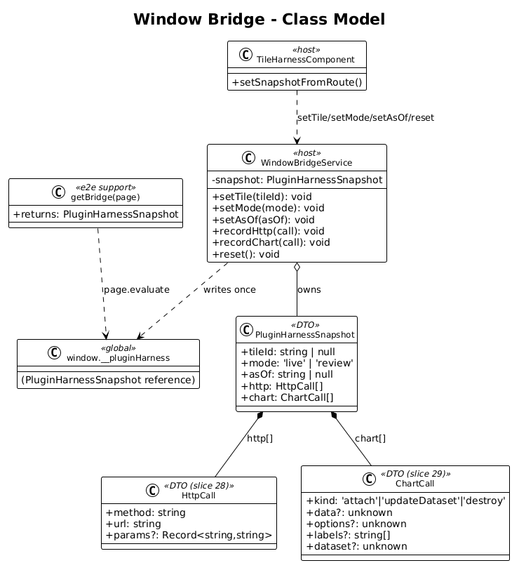
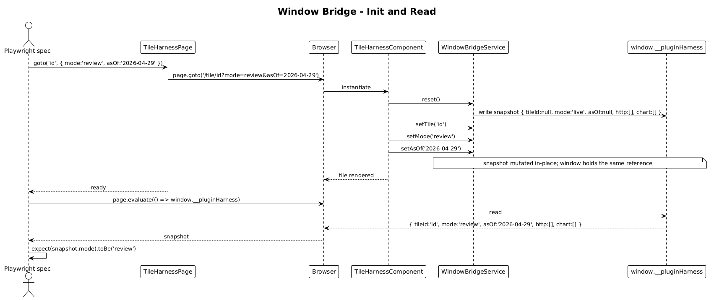

# Window Bridge — Detailed Design

**Status:** Accepted

## 1. Overview

Goal: expose a small, deliberately-shaped object on `window` so Playwright tests can read what the harness *believes* is true (current `tileId`, `mode`, `asOf`) and — once slices 28 and 29 land — what *interactions* the plugin tile has produced (HTTP requests, chart configs).

This is the bridge from `pllug in testing.drawio`:

> commitments dashboard plugin host app → **window bridge** → (test runtime via `page.evaluate`)

The radically-simple form is a singleton service that owns one mutable object and exposes it as `window.__pluginHarness`. No event emitters, no observables, no message channels — just a plain object the test can read.

**Scope boundary:** this slice owns the `WindowBridgeService` skeleton + the `mode`/`asOf`/`tileId` keys + a Playwright helper to read the bridge. It deliberately leaves the `http` and `chart` keys empty arrays — those are populated by slices 28 and 29.

**Why expose plain `window` keys instead of a custom event?** Tests in `page.evaluate()` already run synchronously inside the browser; reading a property is O(1) and trivially serialised back to Node. Events would need timing handling.

## 2. Architecture

### 2.1 Class Diagram



### 2.2 Bridge Init Sequence



## 3. Component Details

### 3.1 `WindowBridgeService`
- **Location:** `projects/commitments-dashboard-plugin-host/src/app/harness/window-bridge.service.ts`
- **Responsibility:** own a single `PluginHarnessSnapshot` object, write it to `window.__pluginHarness`, and expose `setTile`, `setMode`, `setAsOf`, `recordHttp`, `recordChart` mutators.
- **Lifecycle:** `providedIn: 'root'`. Constructed lazily on first injection (which happens when `TileHarnessComponent` is instantiated).
- **State shape:**
  ```ts
  export interface PluginHarnessSnapshot {
    tileId: string | null;
    mode: 'live' | 'review';
    asOf: string | null;
    http: HttpCall[];        // populated by slice 28
    chart: ChartCall[];      // populated by slice 29
  }
  ```
- **Public API (~25 lines):**
  ```ts
  @Injectable({ providedIn: 'root' })
  export class WindowBridgeService {
    private readonly snapshot: PluginHarnessSnapshot = {
      tileId: null, mode: 'live', asOf: null, http: [], chart: []
    };

    constructor() {
      (window as any).__pluginHarness = this.snapshot;
    }

    setTile(tileId: string): void { this.snapshot.tileId = tileId; }
    setMode(mode: 'live' | 'review'): void { this.snapshot.mode = mode; }
    setAsOf(asOf: string | null): void { this.snapshot.asOf = asOf; }

    recordHttp(call: HttpCall): void { this.snapshot.http.push(call); }
    recordChart(call: ChartCall): void { this.snapshot.chart.push(call); }

    reset(): void {
      this.snapshot.tileId = null;
      this.snapshot.mode = 'live';
      this.snapshot.asOf = null;
      this.snapshot.http.length = 0;
      this.snapshot.chart.length = 0;
    }
  }
  ```
- **Concurrency:** single-threaded JS. No locks. No race conditions.
- **Memory:** arrays grow per page. Tests typically `goto` each tile fresh, so the bridge's `reset()` is called by the harness on each tile load.

### 3.2 `TileHarnessComponent` integration
- **File:** `projects/commitments-dashboard-plugin-host/src/app/harness/tile-harness.component.ts` (slice 26).
- **Change:** inject `WindowBridgeService`, call `reset()`, then `setTile`, `setMode`, `setAsOf` on each route param change.
- **Effect:** bridge always reflects the current navigation. Test reads it after `goto` resolves.

### 3.3 Playwright helpers (`projects/commitments-dashboard-plugin-host/e2e/support/bridge.ts`)
- **Responsibility:** strong-typed wrappers around `page.evaluate(() => window.__pluginHarness)`.
- **API (~20 lines):**
  ```ts
  export async function getBridge(page: Page): Promise<PluginHarnessSnapshot> {
    return await page.evaluate(() => (window as any).__pluginHarness);
  }
  export async function getBridgeMode(page: Page): Promise<'live' | 'review'> {
    return (await getBridge(page)).mode;
  }
  ```
- **Type sharing:** the `PluginHarnessSnapshot` type lives in the host source under `harness/` and is **re-exported** from `e2e/support/bridge.ts` via a relative import. The host's `tsconfig.spec.json` already maps the workspace, so the e2e config will pick the same path. (Alternative — duplicate the type in `e2e/`. Not radically simpler; rejected.)

### 3.4 Smoke spec extension
- **File:** `projects/commitments-dashboard-plugin-host/e2e/tile-harness-smoke.spec.ts` (extends slice 26).
- **New assertion:** after `goto('commitments.daily-results', { mode: 'review', asOf: '2026-04-01' })`, `getBridge(page)` returns `{ tileId: 'commitments.daily-results', mode: 'review', asOf: '2026-04-01', http: [], chart: [] }`.

## 4. Data Model

### 4.1 `PluginHarnessSnapshot`
| Field | Type | Owner | When set |
|---|---|---|---|
| `tileId` | `string \| null` | `TileHarnessComponent` | On route match |
| `mode` | `'live' \| 'review'` | `TileHarnessComponent` | On query-param change |
| `asOf` | `string \| null` | `TileHarnessComponent` | On query-param change |
| `http` | `HttpCall[]` | `HttpRecorderInterceptor` (slice 28) | Per outgoing request |
| `chart` | `ChartCall[]` | `WindowBridgeChartRecorder` (slice 29) | Per chart adapter call |

Slice 27 fills in only the first three fields. The `http` / `chart` arrays exist as empty placeholders so later slices can append without touching this slice's API.

### 4.2 `HttpCall` and `ChartCall` types (declared empty here, body in slices 28/29)
```ts
export type HttpCall = { method: string; url: string; params?: Record<string, string> };
export type ChartCall =
  | { kind: 'attach'; type: 'line'; data: unknown; options: unknown }
  | { kind: 'updateDataset'; labels: string[]; dataset: unknown }
  | { kind: 'destroy' };
```
Defining the shapes now keeps the bridge's types stable and lets the e2e helpers compile.

## 5. Key Workflows

### 5.1 Test reads current mode after navigation
1. Test calls `harness.goto('commitments.consistency-trend', { mode: 'review', asOf: '2026-04-29' })`.
2. Browser navigates. `TileHarnessComponent` constructs.
3. Component injects `WindowBridgeService`, calls `reset()`, then `setTile('commitments.consistency-trend')`, `setMode('review')`, `setAsOf('2026-04-29')`.
4. Tile renders.
5. POM resolves `expect(tile).toBeVisible()`.
6. Spec calls `getBridge(page)`. Playwright calls `page.evaluate(() => window.__pluginHarness)` and returns the snapshot.
7. Assertion: `expect(snapshot.mode).toBe('review')`.

## 6. Why "Radically Simple"

- **One singleton, no events, no streams.** Mutating an object is the simplest possible publish mechanism.
- **No auto-serialisation tricks.** `window.__pluginHarness` is a plain object; Playwright's `page.evaluate` returns it as-is.
- **No conditional "is-test-mode" flag.** The bridge runs in every host bootstrap. Cost: one tiny service. Benefit: the host always behaves identically whether opened by a developer or by Playwright.
- **No magic-string contract sprawl.** A single `PluginHarnessSnapshot` type is the ABI between host code and e2e specs.

## 7. Open Questions

1. **Production safety.** The host is a *test harness only* — it's not deployed as a product. Still: the bridge writes to `window.__pluginHarness` unconditionally. Should the field name include a `__` prefix to signal "internal" (it does), or live behind `if (window.__pluginHarnessEnabled)` guard? Recommendation: ship the unconditional write — the host is never built for production.
2. **Reset semantics.** Currently `reset()` clears arrays *and* resets `tileId/mode/asOf`. An alternative is to *only* clear arrays on every navigation (so `getBridge()` can be inspected mid-navigation without losing http/chart history). The proposed impl resets everything on each tile load because each test starts from a fresh URL and a clean snapshot is the expected behavior.
3. **Window typings.** Adding `(window as any).__pluginHarness` is loose. Could add a `Window` interface augmentation in a `harness/window.d.ts`. Tradeoff: one tiny declaration file. Recommend ship the augmentation.

## 8. Out of Scope

- HTTP recording — slice 28.
- Chart config recording — slice 29.
- Per-tile specs that inspect the bridge — slices 30, 31, 32.
