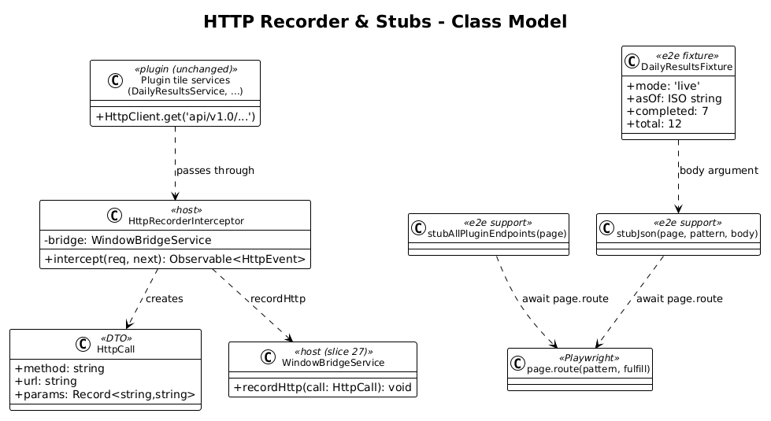
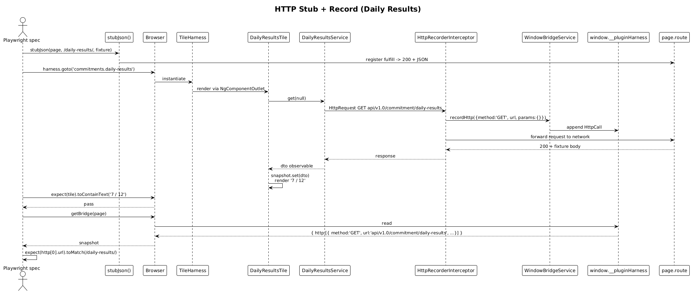

# HTTP Recorder & Stubs — Detailed Design

## 1. Overview

Goal: let Playwright tests **stub** the HTTP responses the plugin tile receives (so tests are deterministic and the backend is never touched), and **record** the HTTP requests the plugin actually issued (so tests can assert the tile called the right endpoint with the right query params).

This satisfies two parts of the brief:
- *"playwright tests do not exercise dashboard-framework code"* — they don't talk to the real API either.
- *"verify the commitments-dashboard-plugin tiles are calling into … correctly"* — recording the HTTP shape is one of two verification axes (the other is chart, slice 29).

The radically-simple approach is **two layers**:

1. **Stubbing — Playwright `page.route('**/api/v1.0/**')`.** This is a built-in network interceptor; no host code change is required for stubbing.
2. **Recording — a single Angular `HttpInterceptor` in the host** that pushes `{ method, url, params }` into the bridge before the request leaves the browser. Source-side recording stays accurate even when `page.route` rewrites the response.

Plugin code is not modified.

**Scope boundary:** this slice owns the host-side interceptor + a Playwright fixture helper for response stubbing. Per-tile assertions live in slices 30-32.

## 2. Architecture

### 2.1 Class Diagram



### 2.2 Sequence — Stub + Record



## 3. Component Details

### 3.1 `HttpRecorderInterceptor` (host)
- **Location:** `projects/commitments-dashboard-plugin-host/src/app/harness/http-recorder.interceptor.ts`
- **Responsibility:** observe every outgoing `HttpRequest` and push a serialisable record to `WindowBridgeService.recordHttp`.
- **Implementation (~20 lines):**
  ```ts
  @Injectable()
  export class HttpRecorderInterceptor implements HttpInterceptor {
    constructor(private readonly bridge: WindowBridgeService) {}
    intercept(req: HttpRequest<unknown>, next: HttpHandler) {
      const params: Record<string, string> = {};
      for (const k of req.params.keys()) {
        params[k] = req.params.get(k) ?? '';
      }
      this.bridge.recordHttp({ method: req.method, url: req.urlWithParams, params });
      return next.handle(req);
    }
  }
  ```
- **Wired in `app.config.ts`** via `provideHttpClient(withInterceptors([httpRecorderInterceptor]))` — using the functional interceptor form (matches Angular 21 idioms used elsewhere in the workspace).
- **Order:** the recorder is the *only* host-level interceptor. There is no other middleware in the host today.

### 3.2 Playwright stub helper (`projects/commitments-dashboard-plugin-host/e2e/support/http-stub.ts`)
- **Responsibility:** ergonomic wrapper over `page.route` for the most common case — "given URL pattern, return JSON".
- **API (~30 lines):**
  ```ts
  export async function stubJson(
    page: Page,
    pattern: string | RegExp,
    body: unknown,
    init: { status?: number } = {}
  ): Promise<void> {
    await page.route(pattern, async (route) => {
      await route.fulfill({
        status: init.status ?? 200,
        contentType: 'application/json',
        body: JSON.stringify(body)
      });
    });
  }

  export async function stubAllPluginEndpoints(page: Page): Promise<void> {
    // Default: every /api/v1.0/* gets {} until a more specific stub overrides.
    await page.route(/\/api\/v1\.0\/.*/, async (route) =>
      route.fulfill({ status: 200, contentType: 'application/json', body: '{}' })
    );
  }
  ```
- **Specificity rule:** `page.route` honours later-registered routes first, so per-tile fixtures registered after `stubAllPluginEndpoints` win.

### 3.3 Fixture catalogue (`projects/commitments-dashboard-plugin-host/e2e/fixtures/`)
- One JSON-shaped TS file per DTO: `daily-results.fixture.ts`, `weekly-focus.fixture.ts`, etc.
- **Why TS, not JSON?** Type-safety: `DailyResultsDto` is exported from `@commitments/dashboard-plugin`; fixtures are typed against it.
- **Example:**
  ```ts
  import { DailyResultsDto } from '@commitments/dashboard-plugin';

  export const dailyResultsFixture: DailyResultsDto = {
    mode: 'live',
    asOf: '2026-04-29T00:00:00Z',
    date: '2026-04-29',
    completed: 7,
    total: 12
  };
  ```
- **Slice scope:** this slice ships *one* fixture (Daily Results) and one demo spec exercising it. Per-tile fixtures arrive in slices 30/31.

### 3.4 Bridge type filled in
- `HttpCall` type (declared empty in slice 27) gets its body in this slice:
  ```ts
  export type HttpCall = { method: string; url: string; params: Record<string, string> };
  ```
- The `WindowBridgeService.recordHttp` signature is unchanged.

### 3.5 Demo spec
- **File:** `projects/commitments-dashboard-plugin-host/e2e/http-recorder-demo.spec.ts`
- **Asserts:**
  1. After `stubJson(page, '**/api/v1.0/commitment/daily-results*', dailyResultsFixture)` and `harness.goto('commitments.daily-results')`, the rendered tile shows `7 / 12`.
  2. `getBridge(page).http` contains exactly one entry whose `url` matches `commitment/daily-results` and whose method is `GET`.

## 4. Data Model

### 4.1 `HttpCall`
| Field | Type | Notes |
|---|---|---|
| `method` | `string` | `GET`, `POST`, etc. |
| `url` | `string` | Always `req.urlWithParams` (full URL with query string) |
| `params` | `Record<string, string>` | Convenience copy of query params; first-value-only per key |

### 4.2 Why `urlWithParams`
The plugin's services (e.g. `DailyResultsService`) compose query params via `HttpParams` then pass them in `req.params`. Recording `urlWithParams` produces a single string a test can match against without rebuilding params. Recording `req.params` separately is also useful for granular assertions, hence the extra `params` map.

## 5. Key Workflows

### 5.1 Stubbed Daily Results test
1. Test: `await stubJson(page, /\/api\/v1\.0\/commitment\/daily-results/, dailyResultsFixture)`.
2. Test: `await harness.goto('commitments.daily-results')`.
3. Browser: `TileHarnessComponent` renders `DailyResultsTileComponent`.
4. Tile constructor calls `bindTileMode({ load: (mode, asOf) => controller.load(mode, asOf) })`.
5. Controller calls `DailyResultsService.get(null)` → `HttpClient.get('api/v1.0/commitment/daily-results')`.
6. `HttpRecorderInterceptor` writes `{ method:'GET', url:'api/v1.0/commitment/daily-results', params:{} }` to `bridge.http`.
7. Request leaves browser. Playwright's `page.route` matches the URL, returns the fixture.
8. Tile renders `7 / 12`.
9. Test: `expect(tile).toContainText('7 / 12')`.
10. Test: `const calls = (await getBridge(page)).http; expect(calls).toHaveLength(1); expect(calls[0].url).toMatch(/daily-results/);`.

### 5.2 Stub miss path (deliberate test)
If the test forgets to register a stub, `stubAllPluginEndpoints` (registered in `beforeEach`) returns `{}`. The tile receives an empty body and falls back to its zero-state (`completed: 0, total: 0`). The recorder still captures the request, so the test fails clearly with `expect(...).toContainText('7 / 12')` rather than a timeout.

## 6. Why "Radically Simple"

- **Stubbing uses Playwright as-is** — no host code path for "test mode". The host just makes its real HTTP calls.
- **Recording is one functional interceptor.** No middleware stack. No proxy. No replay infrastructure.
- **Fixtures are typed objects, not JSON files.** Type-safety is free; refactoring the DTO renames the fixture properties at compile time.
- **No per-tile recorder.** The single interceptor sees every tile's HTTP. Tests filter the bridge array by URL pattern.

## 7. Open Questions

1. **Should the interceptor also record response bodies?** Useful for "verify the tile rendered the response shape", but blows up bridge memory and serialisation cost. Recommendation: record requests only. Tests assert on the rendered DOM for response correctness.
2. **Encoding params with multiple values.** `HttpParams` allows multi-value keys (`?tag=a&tag=b`). The proposed `params: Record<string, string>` keeps only the first. The `url` field still carries the full query string for full-fidelity matching. Recommendation: ship as-is; revisit if a tile actually emits multi-value params (none currently do).
3. **WebSocket / SignalR.** The drawio diagram says "HTTP / WS Network Layer". The current plugin tiles do not use WebSockets. Slice 28 is HTTP-only. WS recording can be a slice 35+ once a tile actually needs it.
4. **Stub default-200-empty-body** — is `{}` the right zero-fixture, or should missing endpoints return `404`? `{}` mirrors what the tile would get from a misconfigured endpoint and keeps the page from blowing up; `404` would surface missing fixtures faster but make tests noisier. Recommendation: `{}` plus an explicit "every spec MUST stub the endpoints it expects" rule in `TESTING.md`.

## 8. Out of Scope

- Chart recording — slice 29.
- Per-tile fixtures and full per-tile specs — slices 30, 31.
- Review-mode-specific fixtures — slice 32.
