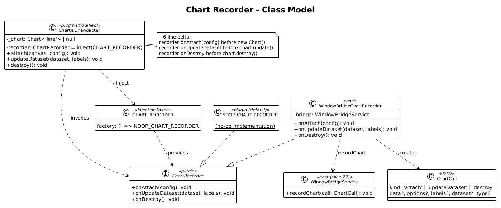
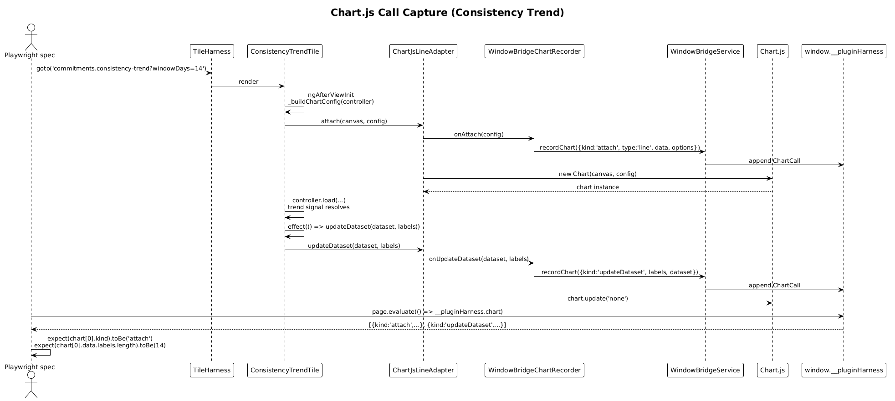

# Chart Recorder — Detailed Design

**Status:** Accepted

## 1. Overview

Goal: let Playwright tests assert that a plugin tile **called Chart.js with the right data and options** — without trying to introspect the canvas pixel grid or the rendered chart.

This satisfies the brief's last bullet: *"need a way to have tests to verify that chart.js is being called as expected by the tiles"*.

The radically-simple approach is **one injection token** in the plugin's existing `ChartJsLineAdapter` (the only Chart.js wrapper today). The token defaults to a no-op recorder, so production behaviour is unchanged. The host overrides the token with a `WindowBridgeChartRecorder` that pushes serialisable summaries onto `window.__pluginHarness.chart` (slice 27 wired the array).

This is the **only plugin code change** in the whole acceptance-testing arc. It is small, surgical, and the default keeps everything else unchanged.

**Scope boundary:** this slice owns the plugin-side token, the host-side recorder implementation, and a single `consistency-trend` demo spec asserting one chart attach call. Per-tile chart-bearing specs come in slice 31.

## 2. Architecture

### 2.1 Class Diagram



### 2.2 Chart Capture Sequence



## 3. Component Details

### 3.1 `CHART_RECORDER` token (plugin-side change)
- **Location:** `projects/commitments-dashboard-plugin/src/lib/data/chart-recorder.token.ts` (new)
- **Definition:**
  ```ts
  export interface ChartRecorder {
    onAttach(config: ChartConfiguration<'line'>): void;
    onUpdateDataset(dataset: ChartDataset<'line'>, labels: string[]): void;
    onDestroy(): void;
  }

  export const NOOP_CHART_RECORDER: ChartRecorder = {
    onAttach() {}, onUpdateDataset() {}, onDestroy() {}
  };

  export const CHART_RECORDER = new InjectionToken<ChartRecorder>('CHART_RECORDER', {
    providedIn: 'root',
    factory: () => NOOP_CHART_RECORDER
  });
  ```
- **Why a token + interface, not a service?** Tests need to swap the implementation; production needs a guaranteed no-op default. A `tree-shakable provider with factory` token gives both with zero overhead.
- **Re-exported** from the plugin's `public-api.ts`.

### 3.2 `ChartJsLineAdapter` modification (plugin-side change, ~6 lines)
- **File:** `projects/commitments-dashboard-plugin/src/lib/data/chart-js-line.adapter.ts`
- **Current methods:** `attach(canvas, config)`, `updateDataset(dataset, labels)`, `destroy()`.
- **Change:** inject `CHART_RECORDER` (defaults to no-op) and call its hook in each method *before* the underlying chart.js call. ~6 line delta.
- **Diff sketch:**
  ```ts
  @Injectable()
  export class ChartJsLineAdapter {
    private readonly recorder = inject(CHART_RECORDER);
    private _chart: Chart<'line'> | null = null;

    attach(canvas: ElementRef<HTMLCanvasElement>, config: ChartConfiguration<'line'>): void {
      this.recorder.onAttach(config);                 // NEW
      this.destroy();
      this._chart = new Chart(canvas.nativeElement, config);
    }

    updateDataset(dataset: ChartDataset<'line'>, labels: string[]): void {
      this.recorder.onUpdateDataset(dataset, labels); // NEW
      if (!this._chart) return;
      this._chart.data.labels = labels;
      this._chart.data.datasets = [dataset];
      this._chart.update('none');
    }

    destroy(): void {
      if (this._chart) {
        this.recorder.onDestroy();                    // NEW
        this._chart.destroy();
        this._chart = null;
      }
    }
  }
  ```
- **Production impact:** zero. The recorder calls a no-op closure. Bundle size grows by ~80 bytes (the no-op + token).

### 3.3 `WindowBridgeChartRecorder` (host-side)
- **Location:** `projects/commitments-dashboard-plugin-host/src/app/harness/window-bridge-chart-recorder.ts`
- **Responsibility:** map `ChartRecorder` calls onto serialisable `ChartCall` objects and push them through `WindowBridgeService.recordChart`.
- **Implementation (~25 lines):**
  ```ts
  @Injectable({ providedIn: 'root' })
  export class WindowBridgeChartRecorder implements ChartRecorder {
    constructor(private readonly bridge: WindowBridgeService) {}

    onAttach(config: ChartConfiguration<'line'>): void {
      this.bridge.recordChart({
        kind: 'attach',
        type: config.type,
        data: serialiseData(config.data),
        options: serialiseOptions(config.options)
      });
    }

    onUpdateDataset(dataset: ChartDataset<'line'>, labels: string[]): void {
      this.bridge.recordChart({
        kind: 'updateDataset',
        labels: [...labels],
        dataset: serialiseDataset(dataset)
      });
    }

    onDestroy(): void {
      this.bridge.recordChart({ kind: 'destroy' });
    }
  }
  ```
- **Serialisation helpers:** `serialiseData / serialiseOptions / serialiseDataset` strip non-JSON-safe fields (functions, scriptable callbacks, gradient factories) and replace them with placeholder strings like `'<callback>'`. The `data` payload is mostly numeric arrays and label strings, so most of the structure round-trips cleanly. Tests only assert on the parts that round-trip; tile-specific fields like `controller.chartLabels()` arrays are preserved exactly.
- **Provider override** in `app.config.ts`:
  ```ts
  { provide: CHART_RECORDER, useExisting: WindowBridgeChartRecorder }
  ```

### 3.4 `ChartCall` type filled in
The placeholder declared in slice 27 gets its body:
```ts
export type ChartCall =
  | { kind: 'attach'; type: 'line'; data: unknown; options: unknown }
  | { kind: 'updateDataset'; labels: string[]; dataset: unknown }
  | { kind: 'destroy' };
```

### 3.5 Demo spec
- **File:** `projects/commitments-dashboard-plugin-host/e2e/chart-recorder-demo.spec.ts`
- **Asserts:** after `goto('commitments.consistency-trend')`:
  1. The bridge's `chart` array has at least one `{ kind: 'attach', type: 'line' }` entry.
  2. The attach config's `data.labels` length matches the `windowDays` URL input (default 30).
  3. At least one `updateDataset` event is recorded after the controller's `_fetch()` resolves (the trend controller pushes signals → the tile's `effect(() => updateDataset(...))` fires).

## 4. Data Model

### 4.1 `ChartCall` discriminated union
| `kind` | Fields | When |
|---|---|---|
| `attach` | `type`, `data`, `options` | First call to `adapter.attach()` after `ngAfterViewInit`. |
| `updateDataset` | `labels`, `dataset` | Each time a controller signal change drives the tile's `effect(() => updateDataset(...))`. |
| `destroy` | (none) | On tile destroy or before re-attach. |

### 4.2 Why a discriminated union, not three separate arrays
A single ordered timeline is the simplest representation — tests can assert sequence ("attach then 2× updateDataset then destroy") without juggling timestamps. JSON-serialisable, easy to filter.

## 5. Key Workflows

### 5.1 Consistency Trend test asserts chart was wired correctly
1. Test stubs `/api/v1.0/goal-progress/trend*` with a fixture (slice 28's helper).
2. `harness.goto('commitments.consistency-trend?goalId=demo-goal&windowDays=14')`.
3. `ConsistencyTrendTileComponent` resolves `windowDays = 14` via `withComponentInputBinding`.
4. Tile `ngAfterViewInit` calls `adapter.attach(canvas, config)`. Recorder pushes attach event with `data.labels.length === 14`.
5. Tile's signal `effect` calls `adapter.updateDataset(dataset, labels)` once when controller resolves the trend. Recorder pushes updateDataset event.
6. Test reads `getBridge(page).chart`:
   - First entry: `{ kind: 'attach', type: 'line', data: { labels: [14 strings], datasets: [...] } }`.
   - Second entry: `{ kind: 'updateDataset', labels: [14 strings], dataset: { data: [14 numbers], borderColor: '#...', ...}}`.
7. Test asserts shape.

## 6. Why "Radically Simple"

- **One token, three callbacks.** No subclassing chart.js, no monkey-patching, no plugin shim.
- **Default behaviour unchanged.** Production injects the no-op recorder and pays nothing.
- **No second adapter for tests.** The plugin's only chart wrapper is reused; only the recorder swaps.
- **Single-axis serialisation.** Tests assert on the JSON-safe core (data arrays, labels, type). Functions / gradients are stripped to placeholders — tests don't need them, and including them would force per-test deserialisation logic.
- **No globals on `Chart.*`.** We don't intercept Chart.js itself, just the plugin's own thin adapter. If the adapter changes implementations later (different chart lib, server-side rendering, etc.), the recorder API survives.

## 7. Open Questions

1. **What about future non-line chart adapters?** The plugin currently has only `ChartJsLineAdapter`. If a `ChartJsBarAdapter` arrives, it should accept the same `CHART_RECORDER` token and emit `kind: 'attach'` with a different `type` discriminant. The `ChartCall` union widens. Recommendation: name the token `CHART_RECORDER` (not `LINE_CHART_RECORDER`) to leave room.
2. **Recording cost.** Every chart attach/update walks the config object once. For the tiles in scope (≤ 30 points each) this is negligible. If a future tile renders 10k points the serialiser becomes hot. Mitigation: serialiser caps array length at e.g. 1000 points and appends a `truncated` flag. Out of scope for slice 29.
3. **Chart.js plugins (e.g. `todayPointGlow`).** The consistency-trend tile registers an anonymous chart plugin in its config object. The serialiser will represent these as `'<plugin>'` placeholders. Tests should not depend on plugin identity. If future tests do, the recorder can serialise plugin `id` strings — minor extension.
4. **Where does `serialise*` live?** Initially private to `WindowBridgeChartRecorder`. If a second consumer appears, lift to `harness/serialise-chart.ts`. Premature abstraction otherwise.

## 8. Out of Scope

- Per-tile chart specs (Consistency Trend, Monthly Progress, Goal Metrics) — slice 31.
- Review-mode chart highlight assertions — slice 32.
- Non-line-chart adapters — future slice.
