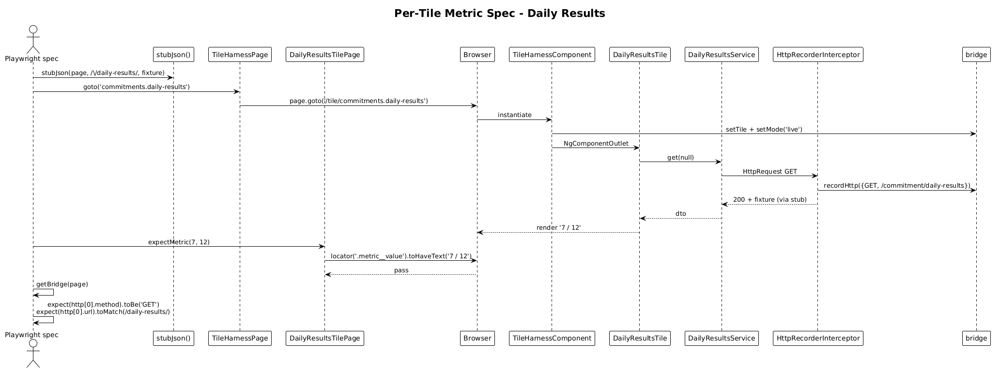

# Metric-Tile Acceptance Suite — Detailed Design

**Status:** Complete

## 1. Overview

Goal: deliver concrete, end-to-end Playwright acceptance specs for the four **metric / list** plugin tiles — those with no chart canvas:

| Tile | `tileId` | DOM signature |
|---|---|---|
| Daily Results | `commitments.daily-results` | metric `7 / 12` + progress bar |
| Weekly Focus | `commitments.weekly-focus` | three-row focus list |
| Outstanding Todos | `commitments.outstanding-todos` | count + warning copy |
| Relations | `commitments.relations` | percentage + label |

Each tile gets one Page Object Model and one spec, all in `live` mode. Specs:

1. Stub the tile's HTTP endpoint with a fixture (slice 28's helper).
2. `harness.goto(tileId)` (slice 26's POM).
3. Assert the rendered DOM reflects the fixture.
4. Assert the bridge's `http` array (slice 27/28) shows the expected request shape.

Chart-bearing tiles (Consistency Trend, Monthly Progress if it has one, Goal Metrics) are slice 31.

This slice exercises everything 25-28 produced. It produces no new infrastructure — only fixtures, POMs, and specs.

**Why metric tiles first?** They have no chart adapter, so they validate the harness + bridge + HTTP layers without needing slice 29. Shipping them ahead of chart tiles gives a working acceptance suite earlier and proves slices 25-28 in production-like usage.

## 2. Architecture

### 2.1 Test Architecture (recap)

This slice is consumer-only. The architecture from slices 25-28 — host on `:4300`, harness route, bridge, HTTP recorder — is the substrate. Tests use the substrate.

### 2.2 Sequence — Per-Tile Metric Spec



## 3. Component Details

### 3.1 Per-tile fixtures
- **Location:** `projects/commitments-dashboard-plugin-host/e2e/fixtures/`
- **Files added in this slice:**
  - `daily-results.fixture.ts` (already added in slice 28's demo; promoted to canonical)
  - `weekly-focus.fixture.ts`
  - `outstanding-todos.fixture.ts`
  - `relations.fixture.ts`
- **Each fixture:** typed against the corresponding plugin DTO, populated with realistic values that exercise the visible DOM:
  - Daily Results: `{ completed: 7, total: 12 }` → "7 / 12" + 58 %.
  - Weekly Focus: 3 focus areas each with `name` + `supportingMetric`.
  - Outstanding Todos: `{ count: 4, todayCount: 1 }` → "4 OPEN".
  - Relations: realistic ratio.

### 3.2 Per-tile Page Object Models
- **Location:** `projects/commitments-dashboard-plugin-host/e2e/pages/`
- **One file per tile.** Each extends a thin pattern:
  ```ts
  import { TileHarnessPage } from './tile-harness.page';

  export class DailyResultsTilePage {
    constructor(private readonly harness: TileHarnessPage) {}

    get root() { return this.harness.tile().filter({ hasText: 'Daily Results' }); }
    get metricValue() { return this.root.locator('.metric__value'); }
    get progressFill() { return this.root.locator('.progress > span'); }
    get statusPillLabel() { return this.root.locator('cui-status-pill .label'); }

    async expectMetric(completed: number, total: number) {
      await expect(this.metricValue).toHaveText(`${completed} / ${total}`);
    }
  }
  ```
- **Selector strategy:** prefer `data-testid` (already on `tile-shell`, `consistency-trend-canvas`, etc.) and stable CSS classes. Avoid querying by Material Component selectors that can change with library versions.
- **No POM per tile owns navigation** — that's the harness's job. POMs only own assertions about a single tile's DOM.

### 3.3 Per-tile spec files
- **Location:** `projects/commitments-dashboard-plugin-host/e2e/tiles/`
- **Files added in this slice:**
  - `daily-results.spec.ts`
  - `weekly-focus.spec.ts`
  - `outstanding-todos.spec.ts`
  - `relations.spec.ts`
- **Each spec follows the same shape (~30 lines):**
  ```ts
  import { test, expect } from '@playwright/test';
  import { TileHarnessPage } from '../pages/tile-harness.page';
  import { DailyResultsTilePage } from '../pages/daily-results-tile.page';
  import { stubJson, stubAllPluginEndpoints } from '../support/http-stub';
  import { getBridge } from '../support/bridge';
  import { dailyResultsFixture } from '../fixtures/daily-results.fixture';

  test.describe('daily-results tile', () => {
    let harness: TileHarnessPage;
    let tile: DailyResultsTilePage;

    test.beforeEach(async ({ page }) => {
      await stubAllPluginEndpoints(page);
      harness = new TileHarnessPage(page);
      tile = new DailyResultsTilePage(harness);
    });

    test('renders the fixture metric', async ({ page }) => {
      await stubJson(page, /\/commitment\/daily-results/, dailyResultsFixture);
      await harness.goto('commitments.daily-results');
      await tile.expectMetric(7, 12);
    });

    test('issues a GET to /api/v1.0/commitment/daily-results', async ({ page }) => {
      await stubJson(page, /\/commitment\/daily-results/, dailyResultsFixture);
      await harness.goto('commitments.daily-results');
      const { http } = await getBridge(page);
      const call = http.find((c) => c.url.includes('commitment/daily-results'));
      expect(call?.method).toBe('GET');
    });
  });
  ```
- **Test count:** 2 per tile × 4 tiles = 8 specs. Total runtime ≤ 30 s on `lg-desktop`.

### 3.4 Optional shared `beforeEach` helper
If the boilerplate gets repetitive across slices 30/31/32, a `tileTest` Playwright fixture can be introduced later. **Not in this slice** — the boilerplate is so light (4 lines) that abstracting it is premature.

## 4. Tile-by-Tile Acceptance Matrix

| Tile | DOM assertion | Bridge HTTP assertion |
|---|---|---|
| Daily Results | `'7 / 12'` value, ARIA `progressbar` aria-valuenow=7, aria-valuemax=12 | `GET ../commitment/daily-results` |
| Weekly Focus | 3 focus rows visible, each with name + supporting metric | `GET ../weekly-focus` |
| Outstanding Todos | `'4 OPEN'` status pill, count `4` styled with warn color | `GET ../todos/outstanding-count` |
| Relations | Percentage value matches fixture, label reads "Relations" | `GET ../relations-summary` (URL TBD per code) |

The exact URLs are taken from the existing plugin services (`weekly-focus.service.ts`, `outstanding-todos.service.ts`, `relations-summary.service.ts`). Specs hard-code the path fragment (e.g. `/weekly-focus`) so a refactor that *changes* the URL is caught.

## 5. Why "Radically Simple"

- **One spec per tile, one POM per tile, one fixture per tile.** No clever generators, no parameterised test runners. Reading the suite tells you what each tile does.
- **Reuse the four artefacts from slices 25-28.** No new infra. The substrate is enough.
- **No mocks of plugin code.** The plugin's services and tile components are exercised exactly as they ship.
- **Two assertions per spec.** DOM + HTTP. No more.

## 6. Open Questions

1. **Weekly Focus assertion granularity.** Should the spec assert each row's `supportingMetric` text? Recommendation: yes — the supporting metric is the tile's value-add. One additional `expect(rows.nth(i)).toContainText(fixture.focusAreas[i].supportingMetric)`.
2. **Relations URL.** Confirm the exact path string in `relations-summary.service.ts` before writing the regex. Trivial verification.
3. **Tiles that *both* render and call HTTP for `todayCount`-style optional fields.** Outstanding Todos has an optional `todayCount`; the spec should pick a fixture that exercises the visible code path. Recommendation: include `todayCount: 1` so the visible "today" copy code path is exercised.

## 7. Out of Scope

- Chart-bearing tiles — slice 31.
- Review-mode behaviour — slice 32.
- A11y assertions (axe-core) — future slice.
- Any UI design-token color assertions — those belong in `commitments-app/e2e/dashboard.spec.ts`, not here. The plugin host tests verify *behaviour*, not visual design.
