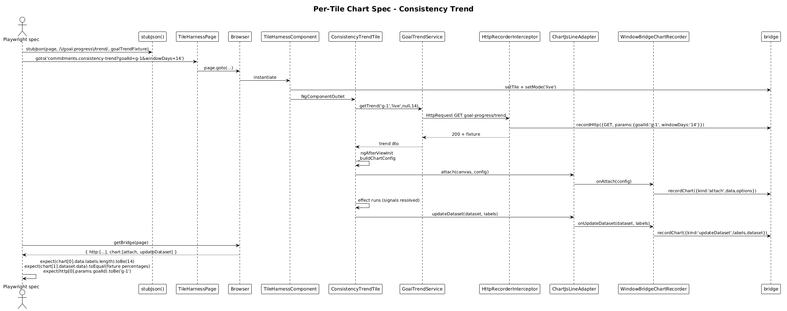

# Chart-Tile Acceptance Suite — Detailed Design

## 1. Overview

Goal: deliver concrete, end-to-end Playwright acceptance specs for every plugin tile that draws a chart. These tiles need the chart-recorder bridge from slice 29 in addition to the HTTP / DOM substrate from slices 25-28.

**Tiles in scope:**

| Tile | `tileId` | Chart? | Notes |
|---|---|---|---|
| Consistency Trend | `commitments.consistency-trend` | yes — line | Uses `ChartJsLineAdapter` and a `todayPointGlow` plugin |
| Monthly Progress | `commitments.monthly-progress` | conditional | Confirm against component source — if it renders a chart, slice 31 covers it; otherwise it falls under slice 30 |
| Goal Metrics | `commitments.goal-metrics` | conditional | Same as above |

If Monthly Progress and Goal Metrics turn out to be metric-only tiles, this slice covers Consistency Trend only and the other two get covered under slice 30. Either way the slice number stays valid — open question (1) below tracks the verification.

Each chart tile gets one POM and one spec. Specs:

1. Stub HTTP fixture (slice 28).
2. `harness.goto(tileId, { mode: 'live' })`.
3. Assert visible canvas + computed text overlays (e.g. delta badge, peak/low caption).
4. Assert recorded chart calls (slice 29's bridge): `attach` with expected `data.labels.length`, `dataset.data` matching fixture, plus at least one `updateDataset`.
5. Assert HTTP record (slice 28).

## 2. Architecture

### 2.1 Test Architecture (recap)

Same substrate as slice 30. The new dimension is the bridge's `chart` array — populated by `WindowBridgeChartRecorder` (slice 29) on each call from the plugin tile through `ChartJsLineAdapter`.

### 2.2 Sequence — Consistency Trend Spec



## 3. Component Details

### 3.1 Per-tile fixtures
- **Location:** `projects/commitments-dashboard-plugin-host/e2e/fixtures/`
- **Files added:**
  - `goal-trend.fixture.ts` — a 14-day `GoalTrendDto` with monotonic-but-noisy points so the spec can assert the computed `currentPercentage`, `peakPercentage`, `lowPercentage`, and `deltaLabel` with deterministic values.
  - `monthly-progress.fixture.ts` — only if Monthly Progress renders a chart.
  - `goal-metrics.fixture.ts` — only if Goal Metrics renders a chart.
- **Why deterministic numbers?** The Consistency Trend controller's `synthesizeDemoTrend` is only used when `goalId === 'demo-goal'`. Real fixtures bypass the demo path; specs target a non-demo `goalId` (e.g. `g-1`) and stub the trend endpoint with the fixture.

### 3.2 Per-tile Page Object Models
- **Location:** `projects/commitments-dashboard-plugin-host/e2e/pages/`
- **`ConsistencyTrendTilePage`:**
  ```ts
  export class ConsistencyTrendTilePage {
    constructor(private readonly harness: TileHarnessPage) {}

    get root() { return this.harness.tile().filter({ hasText: 'Consistency Trend' }); }
    get canvas() { return this.harness.page.getByTestId('consistency-trend-canvas'); }
    get currentPercent() { return this.root.locator('cui-metric-header .value'); }
    get peakLow() { return this.root.locator('cui-metric-header .sub-caption'); }
    get deltaBadge() { return this.root.locator('cui-delta-badge'); }

    async expectCanvasVisibleAndSized() {
      await expect(this.canvas).toBeVisible();
      const box = await this.canvas.boundingBox();
      expect(box?.width ?? 0).toBeGreaterThan(0);
      expect(box?.height ?? 0).toBeGreaterThan(0);
    }
  }
  ```
- POMs for Monthly Progress / Goal Metrics follow the same pattern only if those tiles render charts.

### 3.3 Per-tile spec
- **File:** `projects/commitments-dashboard-plugin-host/e2e/tiles/consistency-trend.spec.ts` (~50 lines)
- **Asserts:**
  ```ts
  test('renders fixture canvas and computed metrics', async ({ page }) => {
    await stubJson(page, /\/goal-progress\/trend/, goalTrendFixture);
    await harness.goto('commitments.consistency-trend?goalId=g-1&windowDays=14');
    await tile.expectCanvasVisibleAndSized();
    await expect(tile.currentPercent).toHaveText(`${goalTrendFixture.currentPercentage}%`);
    await expect(tile.peakLow).toContainText(`Peak ${goalTrendFixture.peakPercentage}%`);
    await expect(tile.peakLow).toContainText(`Low ${goalTrendFixture.lowPercentage}%`);
    await expect(tile.deltaBadge).toContainText(goalTrendFixture.deltaLabel);
  });

  test('passes the trend points to chart.js', async ({ page }) => {
    await stubJson(page, /\/goal-progress\/trend/, goalTrendFixture);
    await harness.goto('commitments.consistency-trend?goalId=g-1&windowDays=14');
    await expect(tile.canvas).toBeVisible();
    const { chart } = await getBridge(page);
    const attach = chart.find((c) => c.kind === 'attach');
    expect(attach).toBeDefined();
    expect((attach as any).data.labels).toHaveLength(14);
    const update = chart.find((c) => c.kind === 'updateDataset');
    expect(update).toBeDefined();
    expect((update as any).labels).toEqual(goalTrendFixture.points.map((p) => p.date));
    expect((update as any).dataset.data).toEqual(goalTrendFixture.points.map((p) => p.percentage));
  });

  test('issues a GET to /api/v1.0/goal-progress/trend with goalId and windowDays', async ({ page }) => {
    await stubJson(page, /\/goal-progress\/trend/, goalTrendFixture);
    await harness.goto('commitments.consistency-trend?goalId=g-1&windowDays=14');
    const { http } = await getBridge(page);
    const call = http.find((c) => c.url.includes('goal-progress/trend'));
    expect(call?.params['goalId']).toBe('g-1');
    expect(call?.params['windowDays']).toBe('14');
  });
  ```
- Three assertions — DOM, chart, HTTP — one for each axis the slices 25-29 exposed.

### 3.4 Spec count
- Consistency Trend: 3 specs.
- Monthly Progress: 0-3 specs (depends on whether it has a chart).
- Goal Metrics: 0-3 specs.
- **Worst case:** 9 specs total. **Best case:** 3.

Total runtime ≤ 30 s on `lg-desktop`.

## 4. Bridge Read Pattern

The chart-record array is order-sensitive: `attach` always precedes the first `updateDataset`. Specs may assert ordering with:

```ts
const attachIdx = chart.findIndex((c) => c.kind === 'attach');
const updateIdx = chart.findIndex((c) => c.kind === 'updateDataset');
expect(attachIdx).toBeLessThan(updateIdx);
```

But this is rarely needed — the more useful assertion is "the labels and data passed to chart.js match the fixture", which directly proves the controller-to-adapter pipeline.

## 5. Why "Radically Simple"

- **Same per-tile pattern as slice 30, plus one extra assertion (chart).** Reading any spec tells you the tile's contract end-to-end.
- **No DOM-pixel chart assertion.** No screenshot diffing, no Chart.js internals access. The bridge gives precise, JSON-shape, semantic assertions.
- **Determinism comes from fixtures, not seeded RNG.** Tests don't depend on the controller's `synthesizeDemoTrend` randomness.
- **One file per tile.** `consistency-trend.spec.ts`, `consistency-trend-tile.page.ts`, `goal-trend.fixture.ts`. Easy to read, easy to maintain.

## 6. Open Questions

1. **Do Monthly Progress and Goal Metrics render charts?** Verify the source files in `commitments-dashboard-plugin/src/lib/tiles/{monthly-progress-tile,goal-metrics-tile}/`. If neither renders a chart, this slice is *just* Consistency Trend and the other two move to slice 30. The slice numbering is unchanged either way.
2. **Should the spec assert the tile's `todayPointGlow` chart-plugin is registered?** The serialiser will represent `config.plugins` as `'<plugin>'` placeholders. Asserting on plugin id requires extending the serialiser. Recommendation: skip — the visual highlight is verified by the existing `commitments-app` chart-tile e2e, not by plugin acceptance.
3. **Canvas pixel-dimension assertion.** Slice 30 doesn't have one (no canvas). For chart tiles the canvas-bounding-box check (`>0`) is borrowed from `commitments-app/e2e/chart-tile.spec.ts`. It's redundant in CI (chart.js always produces a sized canvas) but caught a real bug once. Recommendation: keep.

## 7. Out of Scope

- Review-mode chart highlight assertions (`highlightedIndex` shifts) — slice 32.
- Multi-chart adapters — slice 29's open question (1).
- Visual regression for chart pixels — out of scope for plugin acceptance.
