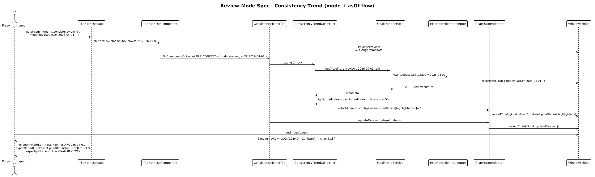

# Review-Mode Acceptance Suite — Detailed Design

**Status:** Accepted

## 1. Overview

Goal: prove every plugin tile reacts correctly when `TILE_CONTEXT` reports `mode: 'review'` with an `asOf` date — by asserting on the **observable side-effects** the plugin produces:

1. The HTTP call to the backend includes the `asOf` query param (per service code).
2. The status pill switches to the `review` variant.
3. For chart tiles, `controller.highlightedIndex` shifts away from "today" so the dataset's point styling differs from live mode.

In live mode (slices 30/31) every tile is exercised with `mode=live`. In this slice every tile gets a paired spec for `mode=review` plus an `asOf` URL parameter. The bridge's `mode` and `asOf` fields (slice 27) and the `http` records (slice 28) and `chart` records (slice 29) are all read to verify the plugin's response.

This closes the acceptance arc — every observable behavior of every plugin tile is now a green or red test.

## 2. Architecture

### 2.1 Sequence — Review-Mode Spec



## 3. Component Details

### 3.1 Review fixtures
- **Location:** `projects/commitments-dashboard-plugin-host/e2e/fixtures/review/`
- **Files added:** one per tile. Each is the `live` fixture with `mode: 'review'` and `asOf` set to a stable past date (e.g. `'2026-04-01'`). Some tiles' DTOs include extra fields in review mode (e.g. Outstanding Todos has `todayCount`); review fixtures populate them.
- **Why a separate folder?** Tests load `live` and `review` fixtures from clearly distinct paths; greps for `review/` immediately surface mode-specific data.

### 3.2 Per-tile review specs
- **Location:** `projects/commitments-dashboard-plugin-host/e2e/tiles/review/`
- **One spec per tile:** `daily-results.review.spec.ts`, `weekly-focus.review.spec.ts`, `outstanding-todos.review.spec.ts`, `relations.review.spec.ts`, `consistency-trend.review.spec.ts` (+ Monthly Progress and Goal Metrics if in scope per slice 31).
- **Each spec asserts (~30 lines):**
  ```ts
  test.describe('daily-results tile (review)', () => {
    test.beforeEach(async ({ page }) => {
      await stubAllPluginEndpoints(page);
    });

    test('passes asOf to the backend and shows REVIEW pill', async ({ page }) => {
      await stubJson(page, /\/commitment\/daily-results/, dailyResultsReviewFixture);
      const harness = new TileHarnessPage(page);
      await harness.goto('commitments.daily-results', { mode: 'review', asOf: '2026-04-01' });

      const tile = new DailyResultsTilePage(harness);
      await tile.expectMetric(7, 12);
      await expect(tile.statusPillLabel).toHaveText('REVIEW');

      const { mode, asOf, http } = await getBridge(page);
      expect(mode).toBe('review');
      expect(asOf).toBe('2026-04-01');
      const call = http.find((c) => c.url.includes('commitment/daily-results'));
      expect(call?.url).toContain('asOf=2026-04-01');
    });
  });
  ```
- The **only** new assertion shape vs slice 30/31 is "the URL the plugin chose includes `asOf`". For chart tiles a second new assertion is added: "the highlighted-index shift produces a different dataset point size or color compared to live", read out of `chart[N].dataset`.

### 3.3 Chart-tile review specifics
- **Consistency Trend:** controller's `highlightedIndex` returns `points.length - 1` in live but `points.findIndex(p => p.date === asOf)` in review.
  - In review fixture pick `asOf` such that it matches a non-last point (e.g. fixture has 14 points, `asOf` matches index 9).
  - Spec reads `chart[1].dataset.pointRadius` (an array per slice 29's serializer) and asserts the index-9 entry equals the highlighted radius (7) while the last index equals the default (3).
  - Concretely:
    ```ts
    const update = chart.find((c) => c.kind === 'updateDataset');
    expect((update as any).dataset.pointRadius[9]).toBe(7);
    expect((update as any).dataset.pointRadius[13]).toBe(3);
    ```
- This assertion is the cleanest possible proof that mode plumbing reaches the chart layer.

### 3.4 Cross-mode signal flow assertion (one shared spec)
- **Location:** `projects/commitments-dashboard-plugin-host/e2e/cross-mode/mode-signal-flow.spec.ts`
- **Purpose:** prove `bindTileMode` ⇒ controller.load is invoked once with the mode-from-context, regardless of which tile.
- **Asserts:** for any one tile (Daily Results), `harness.goto(..., { mode: 'review', asOf })` produces *exactly one* HTTP call (no duplicate live + review), and the call's `mode` query param (where the service emits one) matches the URL.
- This is one extra spec, not per tile — it guards against `bindTileMode` regressions across the plugin.

## 4. Acceptance Matrix

| Tile | DOM signal | HTTP signal | Chart signal |
|---|---|---|---|
| Daily Results | `REVIEW` pill | `?asOf=...` | n/a |
| Weekly Focus | (no pill — section bg accent only) | `?asOf=...` | n/a |
| Outstanding Todos | `REVIEW` variant pill | `?asOf=...&includeToday=true` (per service) | n/a |
| Relations | (verify per source) | `?asOf=...` | n/a |
| Consistency Trend | `REVIEW` pill | `?goalId=...&windowDays=...&asOf=...` | `pointRadius[asOfIndex] = 7` |
| Monthly Progress | tbd | `?asOf=...` | tbd |
| Goal Metrics | tbd | `?asOf=...` | tbd |

## 5. Why "Radically Simple"

- **Each review spec mirrors its live spec.** Reviewers can diff live + review specs side-by-side and see exactly what mode flips.
- **One extra assertion type.** "The URL contains `asOf`". Two assertions for chart tiles: that, plus "highlighted point's radius matches expected index."
- **No additional infra.** Slices 25-29's substrate carries everything.
- **No mode toggling mid-page.** Each spec navigates fresh. The plugin code has no "mode change without reload" path to test.

## 6. Open Questions

1. **Mode toggling without navigation.** In the real product (commitments-app) users flip mode by clicking the segmented control on `DashboardShellComponent`. The plugin host has no shell, so users (and tests) navigate to a new URL. If the team eventually wants tests for "mode flips while a tile is mounted", that's a future slice — possibly with a thin in-host toggle UI. Not needed today.
2. **Asserting on `mode` query param when the plugin does NOT include it.** Some services include `mode` only conditionally (e.g. `OutstandingTodosService` adds `includeToday=true` only in review). Specs match the service's actual behavior; document the per-tile expected URL shape next to the spec.
3. **Time-based fixtures.** Review fixture `asOf` is a literal string (e.g. `'2026-04-01'`). Avoid `new Date()` in fixtures so specs are deterministic across timezones and dates.

## 7. Out of Scope

- Multi-mode chart-plugin behavior (today-glow plugin) — relies on chart.js plugin internals and is verified by visual e2e in `commitments-app`.
- Mode-toggle UI in the host harness — not currently needed; if added, becomes its own slice.
- Localised date formats — none of the in-scope tiles render localised dates.
