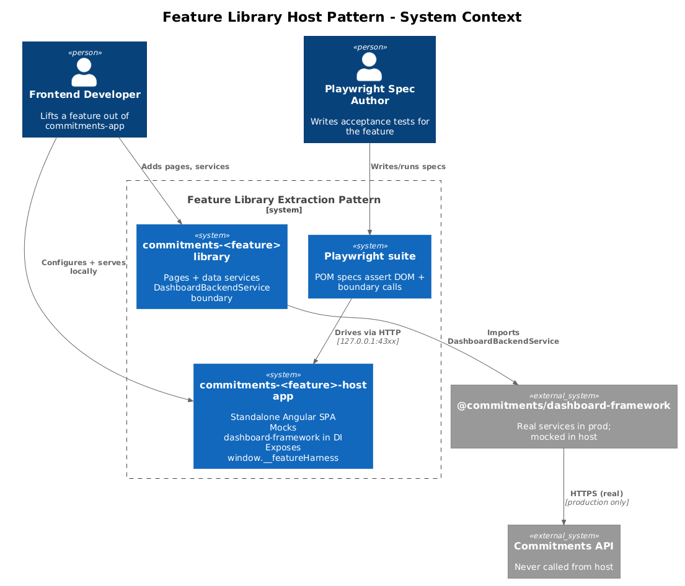
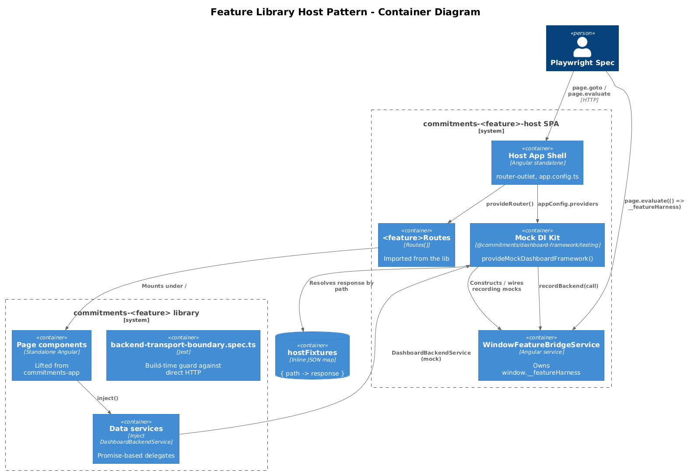
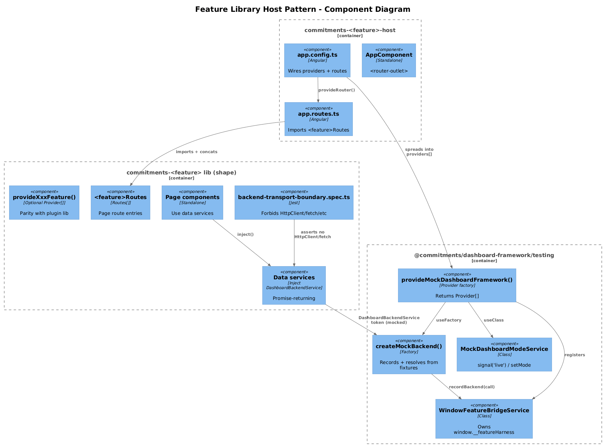
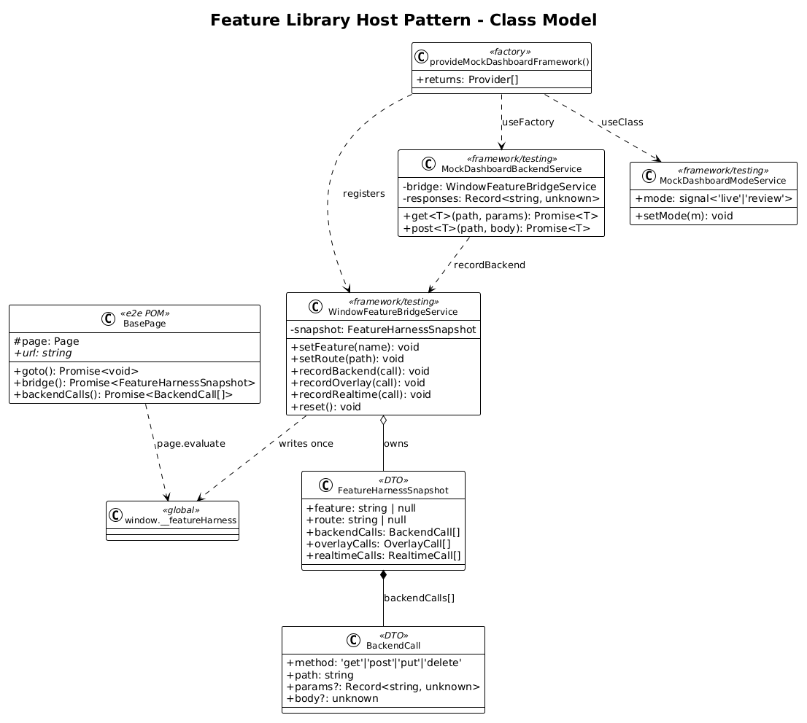
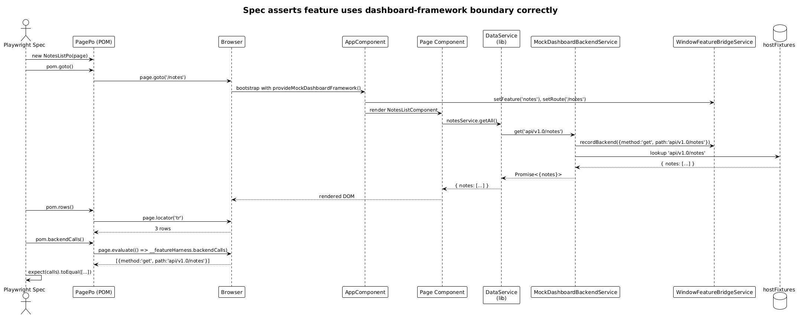

# Feature Library Host Pattern — Detailed Design

## 1. Overview

Goal: define **once** the reusable pattern that every per-feature slice (34 — 41) follows when lifting a feature out of `commitments-app` into its own Angular library. Slices 34 — 41 each apply this pattern to a single bounded context; this slice owns the *shape* of that pattern so each feature design can stay short.

The pattern is the same one already proven by `commitments-dashboard-plugin` + `commitments-dashboard-plugin-host` + slices 25 — 32. The only differences here are:

1. The library hosts **pages with routes**, not dashboard tiles.
2. The library uses `DashboardBackendService` (and any other `dashboard-framework` services it needs) **as its only transport** to the backend — no `HttpClient`, no `signalr`, no `fetch`.
3. The host app replaces every `dashboard-framework` service in DI with a **mock** that records calls into the same `window.__featureHarness` bridge that Playwright reads.

This slice does not migrate any feature itself. It ships:

- A **boundary spec** (`backend-transport-boundary.spec.ts` template) every feature library copies, so the rule "no direct HTTP" is enforced by the build.
- The `WindowFeatureBridgeService` skeleton + `__featureHarness` shape (mirrors slice 27's `WindowBridgeService` but for feature libs).
- A `provideMockDashboardFramework()` factory the host apps call instead of `provideDashboardFramework()`.
- The Playwright `playwright.feature-host.config.ts` template + `support/feature-bridge.ts` helper + Page Object Model conventions.
- A `feature-host` Angular project template (one `ng-app` skeleton with the providers, routes, and e2e folder layout that every feature host inherits).

**Source of intent:** the user request to (a) move every feature out of `commitments-app`, (b) host each library in a `-host` app, (c) mock dashboard-framework in DI, (d) expose a window bridge so Playwright can assert correct interface use, (e) keep each slice radically simple and vertically sliced.

**Scope boundary:** this slice is the *shared kit*. It does **not** create any feature library or migrate any page — those are slices 34 — 41. After this slice ships, every later slice is a roughly-50-line config + small-handful-of-imports change plus the actual move-the-files diff.

## 2. Architecture

### 2.1 C4 Context Diagram



### 2.2 C4 Container Diagram



### 2.3 C4 Component Diagram



## 3. Component Details

### 3.1 The library shape (per feature)

Every feature library uses the exact same Angular package layout. `<feature>` is the kebab-case bounded-context name (e.g., `notes`, `tracking`).

```
frontend/projects/commitments-<feature>/
├── ng-package.json
├── package.json                              ← name: "@commitments/<feature>"
├── tsconfig.lib.json
├── tsconfig.spec.json
├── src/
│   ├── public-api.ts
│   └── lib/
│       ├── data/                             ← thin services that delegate to DashboardBackendService
│       │   └── *.service.ts
│       ├── pages/                            ← lifted from commitments-app/src/app/pages/<page>
│       │   └── <page>/<page>.component.{ts,html,scss,spec.ts}
│       ├── dialogs/                          ← optional; lifted from commitments-app/src/app/components/<dialog>
│       ├── routes.ts                         ← exports the feature's Routes[]
│       ├── provide-<feature>.ts              ← provideXxxFeature() factory (parity with provideCommitmentsDashboardPlugin)
│       └── backend-transport-boundary.spec.ts
```

- `routes.ts` exports `export const <feature>Routes: Routes = [...]` — a flat list of route entries the host (and eventually `commitments-app`) imports.
- `provide-<feature>.ts` returns a `Provider[]` for any feature-scoped DI (rare; usually empty, matching `provideCommitmentsDashboardPlugin`).
- `backend-transport-boundary.spec.ts` is a copy of `commitments-dashboard-plugin/src/lib/data/backend-transport-boundary.spec.ts` with a relative path tweak. Same tests: no `@angular/common/http`, no `signalr`, no `fetch`, no `XMLHttpRequest`, no `WebSocket`.

### 3.2 Data services delegate to `DashboardBackendService`

Each feature library replaces the existing service classes (which use `HttpClient` directly) with services that delegate to `DashboardBackendService` from `@commitments/dashboard-framework`.

Pattern (mirrors `commitments-dashboard-plugin/src/lib/data/daily-results.service.ts`):

```ts
@Injectable({ providedIn: 'root' })
export class NotesService {
  private readonly _backend = inject(DashboardBackendService);

  getBySlug(slug: string): Promise<{ note: Note }> {
    return this._backend.get<{ note: Note }>(`api/v1.0/notes/slug/${slug}`);
  }
}
```

`DashboardBackendService` returns `Promise<T>` (not `Observable<T>`) — see `dashboard-framework/src/lib/backend/dashboard-backend.service.ts`. Each feature library that consumes services with `Observable` callers must convert to `Promise` (toPromise / firstValueFrom) **at the call site**, or migrate the page to async/await. The pattern across slices 34 — 41 prefers async/await because the existing pages are already small and standalone-component-based.

If a feature still needs realtime (SignalR / hubs), it stays in `commitments-app` for now or waits for a `DashboardRealtimeService` to ship in `dashboard-framework`. None of slices 34 — 41 currently require realtime.

### 3.3 `WindowFeatureBridgeService`

- **Location:** `frontend/projects/dashboard-framework/src/lib/testing/window-feature-bridge.service.ts` *(new sub-path inside `dashboard-framework` so every feature host can import it without depending on a separate library — keeps the dependency graph one-way)*.
- **Public API (~30 lines):**
  ```ts
  export interface FeatureHarnessSnapshot {
    feature: string | null;
    route: string | null;
    backendCalls: BackendCall[];
    overlayCalls: OverlayCall[];
    realtimeCalls: RealtimeCall[];
  }

  export interface BackendCall {
    method: 'get' | 'post' | 'put' | 'delete';
    path: string;
    params?: Record<string, unknown>;
    body?: unknown;
  }

  @Injectable({ providedIn: 'root' })
  export class WindowFeatureBridgeService {
    private readonly snapshot: FeatureHarnessSnapshot = {
      feature: null, route: null, backendCalls: [], overlayCalls: [], realtimeCalls: []
    };

    constructor() {
      (window as unknown as { __featureHarness: FeatureHarnessSnapshot }).__featureHarness = this.snapshot;
    }

    setFeature(feature: string): void { this.snapshot.feature = feature; }
    setRoute(route: string): void { this.snapshot.route = route; }
    recordBackend(call: BackendCall): void { this.snapshot.backendCalls.push(call); }
    recordOverlay(call: OverlayCall): void { this.snapshot.overlayCalls.push(call); }
    recordRealtime(call: RealtimeCall): void { this.snapshot.realtimeCalls.push(call); }
    reset(): void {
      this.snapshot.feature = null;
      this.snapshot.route = null;
      this.snapshot.backendCalls.length = 0;
      this.snapshot.overlayCalls.length = 0;
      this.snapshot.realtimeCalls.length = 0;
    }
  }
  ```
- **Why this lives in `dashboard-framework/testing` and not in each host:** every feature host needs the same shape, and Playwright e2e specs must read the same shape. Centralising it lets feature hosts import a single helper and feature spec writers use one import path.
- **Why a single mutable object:** parity with `WindowBridgeService` (slice 27). No events, no streams. `page.evaluate(() => window.__featureHarness)` returns the snapshot in one call.

### 3.4 `provideMockDashboardFramework()`

- **Location:** `frontend/projects/dashboard-framework/src/lib/testing/provide-mock-dashboard-framework.ts`.
- **Responsibility:** return `Provider[]` that **replace** every public service exported from `@commitments/dashboard-framework` with a recording mock that pushes into the bridge.
- **Public API:**
  ```ts
  export function provideMockDashboardFramework(opts?: {
    backendResponses?: Record<string, unknown>;
  }): Provider[] {
    return [
      WindowFeatureBridgeService,
      { provide: DashboardBackendService, useFactory: createMockBackend, deps: [WindowFeatureBridgeService] },
      { provide: DashboardModeService,    useClass: MockDashboardModeService },
      { provide: TileRegistryService,     useClass: NoopTileRegistryService },
      { provide: DASHBOARD_BACKEND_BASE_URL, useValue: '' }
    ];
  }
  ```
- **`createMockBackend`** returns a `DashboardBackendService`-shaped object whose `get(path, params)` (and future `post/put/delete`) record into the bridge **and** resolve from `opts.backendResponses[path]` (default: `{}`). Tests inject responses through the host's bootstrap (see §3.5) or via `page.route` (Playwright HTTP-stub patterns from slice 28 are not needed because the mock backend never makes a real request).
- **`MockDashboardModeService`** exposes `mode: signal('live')` and `setMode(mode)` — minimal API mirroring the real `DashboardModeService`. Switching it from a Playwright spec is one bridge call away.
- **No `provideHttpClient()`:** the mock backend returns inline data; no HTTP layer is needed. This is the radical simplification — the host app never opens a network socket, so tests are deterministic and offline.

### 3.5 The `<feature>-host` app shape

Each feature host is a thin Angular SPA with one component (the feature's routes mounted under `/`). Layout:

```
frontend/projects/commitments-<feature>-host/
├── project.json (or angular.json entry)
├── src/
│   ├── index.html                            ← title: "Commitments <Feature> Host"
│   ├── main.ts
│   ├── styles.scss
│   ├── app/
│   │   ├── app.component.{ts,html,scss}      ← <router-outlet>
│   │   ├── app.config.ts                     ← see below
│   │   └── app.routes.ts                     ← imports <feature>Routes from the lib
│   └── e2e/
│       ├── playwright.feature-host.config.ts
│       ├── support/
│       │   ├── feature-bridge.ts             ← getBridge(page) + types
│       │   └── pom-base.ts                   ← BasePage class
│       └── *.spec.ts                         ← per-page POM specs
```

Bootstrap (the only file that ever changes between hosts):

```ts
// frontend/projects/commitments-<feature>-host/src/app/app.config.ts
export const appConfig: ApplicationConfig = {
  providers: [
    provideAnimations(),
    provideRouter(<feature>Routes),
    ...provideMockDashboardFramework({ backendResponses: hostFixtures })
  ]
};
```

Notably **absent**: `provideHttpClient`, `provideDashboardFramework`, the JWT/header interceptors, `DASHBOARD_BACKEND_BASE_URL` (the mock provides an empty value). The host runs offline.

### 3.6 Playwright config + POM convention

- **Config:** `frontend/playwright.feature-host.config.ts` is a parameterised template — one config file per feature host (so each host can be run in isolation and CI parallelism is straightforward). Each feature's config exports the same shape:
  ```ts
  export default defineConfig({
    testDir: './projects/commitments-<feature>-host/e2e',
    use: { baseURL: 'http://127.0.0.1:<port>' },
    webServer: {
      command: 'npm run start:<feature>-host -- --host 127.0.0.1 --port <port>',
      url: 'http://127.0.0.1:<port>',
      reuseExistingServer: !process.env.CI
    },
    workers: 1,
    retries: process.env.CI ? 2 : 0,
    reporter: [['html'], ['junit', { outputFile: 'test-results/<feature>-host-junit.xml' }]]
  });
  ```
  Ports are assigned per slice: 4310, 4320, 4330 ... so multiple hosts can run in parallel locally.
- **POM base class:**
  ```ts
  // support/pom-base.ts
  export abstract class BasePage {
    constructor(protected readonly page: Page) {}
    abstract readonly url: string;
    async goto(): Promise<void> { await this.page.goto(this.url); }
    async bridge(): Promise<FeatureHarnessSnapshot> {
      return await this.page.evaluate(() => (window as any).__featureHarness);
    }
    async backendCalls(): Promise<BackendCall[]> { return (await this.bridge()).backendCalls; }
  }
  ```
- **Per-page POM:** each page in a feature gets a `<Page>Po` class that extends `BasePage` and exposes locators + actions. Specs only call into `Po` methods — no `page.locator(...)` lives in a spec file. (Standard POM conventions, no surprises.)
- **Assertion style:** every spec includes at least one assertion against `pom.backendCalls()` — that is what proves the feature is using the dashboard-framework boundary correctly. Specs assert (a) the user-visible DOM, (b) the backend calls the feature emitted, (c) the params/body shape of those calls. This is the *acceptance contract* the user requested.

### 3.7 NPM scripts (per feature host)

`frontend/package.json` gains four scripts per feature, all uniform:

```jsonc
{
  "start:<feature>-host":    "ng serve commitments-<feature>-host",
  "build:<feature>-host":    "ng build commitments-<feature>-host",
  "e2e:<feature>-host":      "playwright test --config=playwright.<feature>-host.config.ts",
  "e2e:<feature>-host:ui":   "playwright test --config=playwright.<feature>-host.config.ts --ui"
}
```

This slice does not add any of those — slices 34 — 41 each add their own four. The **template** is owned here.

## 4. Data Model

No domain entities. The shapes that matter to this slice are:

### 4.1 Class Diagram



### 4.2 `FeatureHarnessSnapshot`

| Field | Type | Owner | When set |
|---|---|---|---|
| `feature` | `string \| null` | `<feature>-host`'s `app.component.ts` | On bootstrap |
| `route` | `string \| null` | `Router` event subscription in `app.component.ts` | On every navigation |
| `backendCalls` | `BackendCall[]` | mock `DashboardBackendService` factory | Per `get/post/put/delete` |
| `overlayCalls` | `OverlayCall[]` | (future) mock overlay/dialog service | Per dialog open |
| `realtimeCalls` | `RealtimeCall[]` | (future) mock realtime service | Per hub message |

`overlayCalls` / `realtimeCalls` are declared empty so feature slices can append without revising the bridge ABI. None of 34 — 41 need them today.

## 5. Key Workflows

### 5.1 Spec asserts a feature uses the boundary correctly



1. Playwright reads `playwright.<feature>-host.config.ts` and starts the dev server.
2. Spec instantiates a `Po` (e.g., `new NotesListPo(page)`).
3. `pom.goto()` navigates to the page route. Angular bootstraps the host with `provideMockDashboardFramework()`.
4. The page's `OnInit` calls `notesService.getAll()`, which calls the **mock** `DashboardBackendService.get('api/v1.0/notes')`. The mock writes `{ method: 'get', path: 'api/v1.0/notes' }` to `window.__featureHarness.backendCalls` and resolves with `hostFixtures['api/v1.0/notes']`.
5. The page renders.
6. Spec asserts the DOM (`expect(pom.rows).toHaveCount(3)`).
7. Spec calls `pom.backendCalls()` and asserts `expect(calls).toEqual([{ method: 'get', path: 'api/v1.0/notes' }])`. **This is the boundary assertion.**

### 5.2 Developer adds a new feature library (recipe followed by 34 — 41)

1. Run `ng generate library commitments-<feature>` and `ng generate application commitments-<feature>-host`.
2. Copy the page folders out of `commitments-app/src/app/pages/<page>/` into the new lib's `src/lib/pages/`.
3. Replace each lib service's `HttpClient` injection with `DashboardBackendService`. Convert `Observable` returns to `Promise<T>` (or update consumers to `firstValueFrom`).
4. Drop in `backend-transport-boundary.spec.ts` (copy, edit one path).
5. Wire up the host's `app.config.ts` and `app.routes.ts` from the templates in §3.5.
6. Add `playwright.<feature>-host.config.ts` and four NPM scripts.
7. Write one POM + one spec per page (DOM check + backend-calls assertion).
8. Delete the page from `commitments-app` and update `commitments-app/src/app/app.routes.ts` to import the lib's `<feature>Routes` instead.

## 6. Why "Radically Simple"

- **One bridge, one mock factory, one config template.** No code generation, no schematics — just three files and a recipe. Each feature slice is a copy + path tweak.
- **No HTTP layer in tests.** The mock backend resolves inline. The host runs offline. Specs are deterministic and fast.
- **No new transport.** Every library reuses the already-shipped `DashboardBackendService`. Testing whether a library uses it correctly **is the only thing the bridge measures.** That measurement is exactly what the user asked for.
- **No "is-test" branching in production code.** The boundary spec enforces no direct HTTP at build time. The mock providers replace at host bootstrap, never inside the library. Library code is identical in production and in the host — *that's the property tests need*.

## 7. Open Questions

1. **Where does `WindowFeatureBridgeService` live?** Proposed: `dashboard-framework/src/lib/testing/`, exported from `@commitments/dashboard-framework/testing`. Alternative: a separate `@commitments/feature-host-kit` library. Recommendation: `dashboard-framework/testing` keeps the dependency graph one-way and avoids a new package; if the surface grows beyond ~5 files, split later.
2. **Per-feature host vs one combined host.** A single host could mount every library at different routes, but it loses the *isolation* property the user asked for and inflates blast radius. Recommendation: one host per library, even if some libraries are tiny (Settings).
3. **Realtime mocks.** Slices 34 — 41 do not currently need realtime. When we lift `hub-client.ts` into a `DashboardRealtimeService` in the framework, this pattern grows a `MockDashboardRealtimeService`. Tracked separately.
4. **Shared CSS / theme.** Each host needs the same Material theme `commitments-app` uses. Proposed: each host's `styles.scss` imports the same shared partial that `commitments-app` and the existing plugin host import. No new theme file.
5. **Re-importing the libs into `commitments-app`.** Once a feature is in a library, `commitments-app` imports its `Routes` and the library's `provideXxxFeature()`. The exact diff is part of each per-feature slice.

## 8. Out of Scope

- Migrating any individual feature — slices 34 — 41.
- Dropping `HttpClient` from `commitments-app` itself (interceptors stay until the last library lands).
- Realtime / SignalR mocks (no current consumer needs them).
- CI pipeline integration (a follow-up after every host has a green local run).
