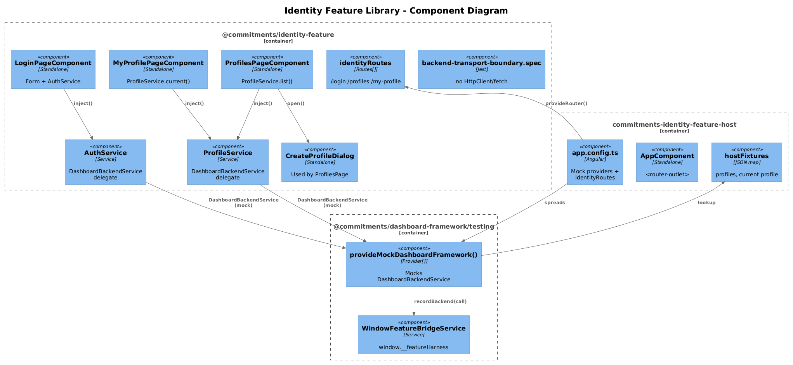
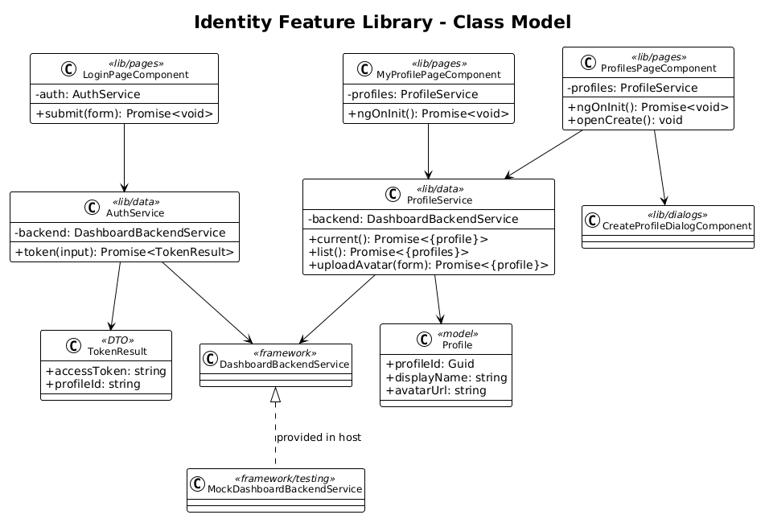
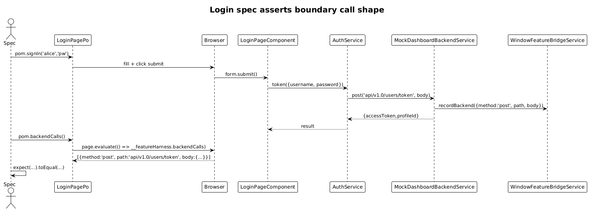

# Identity Feature Library — Detailed Design

**Status:** Accepted

## 1. Overview

Goal: lift the **Login**, **My Profile**, and **Profiles** pages out of `commitments-app/src/app/pages/` into a new `@commitments/identity-feature` library, and stand up a `commitments-identity-feature-host` Angular app where every page can be exercised in isolation by Playwright.

This is the first per-feature application of the [Feature Library Host Pattern](../33-feature-library-host-pattern/README.md). All shared mechanics (the bridge, the mock providers, the boundary spec, the POM base) come from slice 33 — this slice does the **move + wire** for the identity bounded context only.

A separate `frontend/projects/identity/` library already exists and currently contains only `IdentityService` (a thin SignalR/auth shim). This slice **does not collide** with it — it adds a *new* library scoped to identity-related **pages and routes**. The existing `identity` lib is left for a follow-up to merge.

**Scope boundary:** three pages, two services (`AuthService`, `ProfileService`), and the small `CreateProfileDialog`/`CreateProfileDialogService` pair. Everything else stays in `commitments-app`.

**Pages in this slice:**

| Page | Route | Source |
|---|---|---|
| Login | `/login` | `commitments-app/src/app/pages/login/login-page` |
| My Profile | `/my-profile` | `commitments-app/src/app/pages/my-profile/my-profile-page` |
| Profiles | `/profiles` | `commitments-app/src/app/pages/profiles/profiles-page` |

## 2. Architecture

### 2.1 C4 Component Diagram



### 2.2 Class Diagram



### 2.3 Sequence — Login records token call



## 3. Component Details

### 3.1 `@commitments/identity-feature` library

```
frontend/projects/commitments-identity-feature/
└── src/lib/
    ├── data/
    │   ├── auth.service.ts                  ← migrated; uses DashboardBackendService
    │   └── profile.service.ts               ← migrated; uses DashboardBackendService
    ├── pages/
    │   ├── login-page/login-page.component.{ts,html,scss,spec.ts}
    │   ├── my-profile-page/my-profile-page.component.{ts,html,scss,spec.ts}
    │   └── profiles-page/profiles-page.component.{ts,html,scss,spec.ts}
    ├── dialogs/
    │   └── create-profile-dialog/           ← + create-profile-dialog.service.ts
    ├── routes.ts                            ← exports identityRoutes
    ├── provide-identity-feature.ts          ← empty Provider[] today (parity)
    └── backend-transport-boundary.spec.ts
```

`identityRoutes`:

```ts
export const identityRoutes: Routes = [
  { path: 'login',      component: LoginPageComponent },
  { path: 'profiles',   component: ProfilesPageComponent },
  { path: 'my-profile', component: MyProfilePageComponent }
];
```

### 3.2 Service migrations (the only behavioral diff)

`AuthService` and `ProfileService` currently inject `HttpClient` directly. After migration each delegates to `DashboardBackendService`. The endpoints used by the existing services (per slice 01 / 02 / 03 designs) become:

```ts
@Injectable({ providedIn: 'root' })
export class AuthService {
  private readonly _backend = inject(DashboardBackendService);
  token(input: { username: string; password: string }): Promise<{ accessToken: string; profileId: string }> {
    return this._backend.post('api/v1.0/users/token', input);
  }
}

@Injectable({ providedIn: 'root' })
export class ProfileService {
  private readonly _backend = inject(DashboardBackendService);
  current(): Promise<{ profile: Profile }>           { return this._backend.get('api/v1.0/profiles/current'); }
  list():    Promise<{ profiles: Profile[] }>        { return this._backend.get('api/v1.0/profiles'); }
  uploadAvatar(input: FormDataLike): Promise<{ profile: Profile }> { return this._backend.post('api/v1.0/profiles/avatar', input); }
}
```

`DashboardBackendService` only exposes `.get<T>` today — `.post`, `.put`, `.delete` are added as part of this slice (one-line additions; mirror `.get`). This is the minimum framework change required by every later slice (35 — 41 also need `.post` and `.delete`). All four methods are added in slice 33's framework delta, but the *first* concrete consumers ship here.

### 3.3 `commitments-identity-feature-host`

Bootstrap (verbatim slice 33 template; only the import names differ):

```ts
// app.config.ts
export const appConfig: ApplicationConfig = {
  providers: [
    provideAnimations(),
    provideRouter([{ path: '', redirectTo: 'login', pathMatch: 'full' }, ...identityRoutes]),
    ...provideMockDashboardFramework({
      backendResponses: {
        'api/v1.0/profiles':         { profiles: [/* fixture */] },
        'api/v1.0/profiles/current': { profile:  { /* fixture */ } }
      }
    })
  ]
};
```

- Port: **4310**.
- NPM scripts: `start:identity-host`, `e2e:identity-host`, `e2e:identity-host:ui`, `build:identity-host`.

### 3.4 Playwright POM + specs

Three POMs, three specs, all under `projects/commitments-identity-feature-host/e2e/`:

```ts
// support/login-page.po.ts
export class LoginPagePo extends BasePage {
  readonly url = '/login';
  readonly username = this.page.getByLabel('Username');
  readonly password = this.page.getByLabel('Password');
  readonly submit   = this.page.getByRole('button', { name: 'Sign in' });
  async signIn(u: string, p: string) {
    await this.username.fill(u); await this.password.fill(p); await this.submit.click();
  }
}
```

```ts
// login-page.spec.ts
test('submits credentials to api/v1.0/users/token', async ({ page }) => {
  const pom = new LoginPagePo(page);
  await pom.goto();
  await pom.signIn('alice', 'pw');
  const calls = await pom.backendCalls();
  expect(calls).toEqual([{ method: 'post', path: 'api/v1.0/users/token', body: { username: 'alice', password: 'pw' } }]);
});
```

Identical shape for `MyProfilePagePo` (asserts `get api/v1.0/profiles/current`) and `ProfilesPagePo` (asserts `get api/v1.0/profiles`).

### 3.5 `commitments-app` cleanup

`commitments-app/src/app/app.routes.ts` replaces the three `import` lines + three route entries with one import:

```ts
import { identityRoutes } from '@commitments/identity-feature';
// ...
children: [
  { path: '', component: DashboardShellComponent },
  ...identityRoutes,
  // remaining routes unchanged
]
```

The page folders, the two service files, and the dialog folder are deleted from `commitments-app`. Everything else stays.

## 4. Data Model

No new entities. Existing `Profile` and `User` models move from `commitments-app/src/app/models/` into `commitments-identity-feature/src/lib/data/models/` as part of the lift. Cross-feature references to `Profile` (e.g., from Notes, Settings) are addressed in slice 41 — until then, those features re-import from the new lib via `@commitments/identity-feature` *(only as a model dependency — runtime DI stays per-feature)*.

## 5. Key Workflows

The login sequence above is the only non-trivial flow. My-profile and Profiles each fire one `get` on init; both are covered by the standard "page renders + records expected backend call" assertion.

## 6. Why "Radically Simple"

- **No code generation, no abstractions.** The library is a folder copy + two service rewrites. The host is the slice 33 template with three lines changed.
- **No interceptors in the host.** The host doesn't need JWT or header interceptors because the mock backend short-circuits HTTP. The library is interceptor-agnostic — that responsibility stays in `commitments-app`.
- **No fixture framework.** Inline `backendResponses` in `app.config.ts` is enough for the three pages. If a spec needs a different response, the spec calls a small bridge mutator (see slice 33 §3.4) — added in a follow-up only if a real test demands it.

## 7. Open Questions

1. **Merge with the existing `identity` library?** That library currently exports only `IdentityService` (signalr/auth). Merging means moving its single file into the new `identity-feature` lib and updating one import in `commitments-app`. Recommend doing the merge **inside this slice** to avoid leaving two identity libs side-by-side.
2. **Auth interceptors.** `headers.interceptor.ts` and `jwt.interceptor.ts` stay in `commitments-app` for now. The library makes no assumptions about them. When `commitments-app` is itself rebuilt to use only `DashboardBackendService`, the interceptors move into `dashboard-framework` and the host inherits an opt-out.
3. **Login navigation.** The real `LoginPageComponent` calls `Router.navigate(['/'])` after success. In the host, route `/` is `redirectTo: 'login'` — so navigation after login goes to the login page again. Spec uses the post-login `backendCalls` assertion **before** the navigation completes, which is sufficient. Adding a stub landing route is unnecessary noise.

## 8. Out of Scope

- Removing `HttpClient`, JWT/header interceptors from `commitments-app`'s `app.config.ts` — separate cleanup once every slice 34 — 41 has landed.
- Changing the API contract for any identity endpoint. The L1/L2 specs in slices 01 — 03 stay authoritative.
- Realtime (`hub-client.ts`) — stays in `commitments-app/core` until a generic `DashboardRealtimeService` ships.
