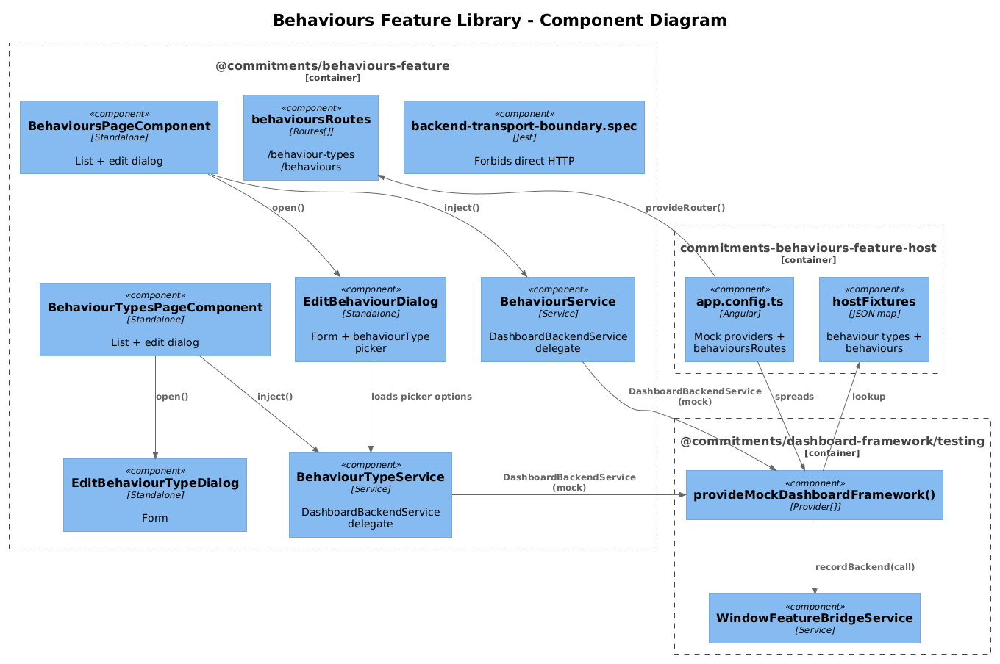
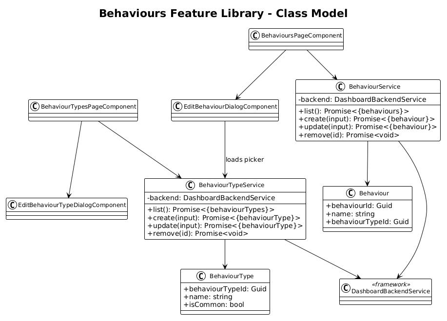
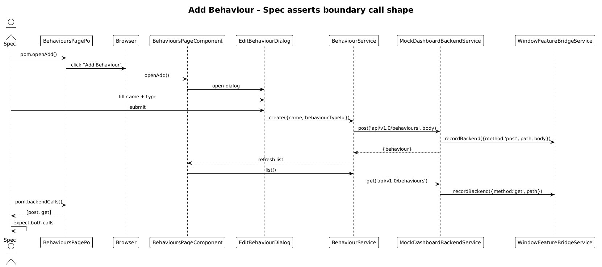

# Behaviours Feature Library — Detailed Design

**Status:** Complete

## 1. Overview

Goal: lift the **Behaviour Types** and **Behaviours** catalog pages out of `commitments-app/src/app/pages/` into `@commitments/behaviours-feature`, with a `commitments-behaviours-feature-host` Angular app driven by Playwright.

Per-feature application of the [Feature Library Host Pattern](../33-feature-library-host-pattern/README.md).

**Pages:**

| Page | Route | Source |
|---|---|---|
| Behaviour Types | `/behaviour-types` | `pages/behaviour-types/behaviour-types-page` |
| Behaviours      | `/behaviours`      | `pages/behaviours/behaviours-page` |

**Services moved:** `BehaviourTypeService`, `BehaviourService`, `EditBehaviourDialogService`, `EditBehaviourTypeDialogService`.
**Dialogs moved:** `EditBehaviourDialog`, `EditBehaviourTypeDialog`.

## 2. Architecture

### 2.1 C4 Component Diagram



### 2.2 Class Diagram



### 2.3 Sequence — Add Behaviour



## 3. Component Details

### 3.1 Library structure

```
frontend/projects/commitments-behaviours-feature/src/lib/
├── data/
│   ├── behaviour.service.ts                 ← DashboardBackendService delegate
│   └── behaviour-type.service.ts            ← DashboardBackendService delegate
├── pages/
│   ├── behaviour-types-page/...
│   └── behaviours-page/...
├── dialogs/
│   ├── edit-behaviour-dialog/
│   ├── edit-behaviour-dialog.service.ts
│   ├── edit-behaviour-type-dialog/
│   └── edit-behaviour-type-dialog.service.ts
├── routes.ts                                 ← behavioursRoutes
├── provide-behaviours-feature.ts             ← empty Provider[]
└── backend-transport-boundary.spec.ts
```

`behavioursRoutes`:

```ts
export const behavioursRoutes: Routes = [
  { path: 'behaviour-types', component: BehaviourTypesPageComponent },
  { path: 'behaviours',      component: BehavioursPageComponent }
];
```

### 3.2 Service migrations

```ts
@Injectable({ providedIn: 'root' })
export class BehaviourTypeService {
  private readonly _backend = inject(DashboardBackendService);
  list():        Promise<{ behaviourTypes: BehaviourType[] }> { return this._backend.get('api/v1.0/behaviourTypes'); }
  create(input): Promise<{ behaviourType: BehaviourType }>    { return this._backend.post('api/v1.0/behaviourTypes', input); }
  update(input): Promise<{ behaviourType: BehaviourType }>    { return this._backend.put('api/v1.0/behaviourTypes', input); }
  remove(id):    Promise<void>                                 { return this._backend.delete(`api/v1.0/behaviourTypes/${id}`); }
}
```

`BehaviourService` follows the identical shape against `api/v1.0/behaviours`.

### 3.3 Host bootstrap

```ts
export const appConfig: ApplicationConfig = {
  providers: [
    provideAnimations(),
    provideRouter([{ path: '', redirectTo: 'behaviours', pathMatch: 'full' }, ...behavioursRoutes]),
    ...provideMockDashboardFramework({
      backendResponses: {
        'api/v1.0/behaviourTypes': { behaviourTypes: behaviourTypeFixture },
        'api/v1.0/behaviours':     { behaviours: behaviourFixture }
      }
    })
  ]
};
```

Port: **4320**.

### 3.4 Playwright POM + specs

```ts
// support/behaviours-page.po.ts
export class BehavioursPagePo extends BasePage {
  readonly url = '/behaviours';
  readonly addButton = this.page.getByRole('button', { name: 'Add Behaviour' });
  readonly rows      = this.page.getByRole('row');
  async openAdd() { await this.addButton.click(); }
}
```

Specs (one per page):

- `behaviours-page.spec.ts` — asserts initial `get api/v1.0/behaviours` call, table renders fixture rows, clicking "Add" dispatches a `post` with the dialog's payload, table re-fetches.
- `behaviour-types-page.spec.ts` — same pattern against `api/v1.0/behaviourTypes`.

Each spec asserts at least one `pom.backendCalls()` entry (the boundary contract).

### 3.5 `commitments-app` cleanup

`app.routes.ts` swaps the two route entries for `...behavioursRoutes` from the new lib. The two page folders, two service files, two dialogs, two dialog service files are deleted.

## 4. Data Model

`Behaviour` and `BehaviourType` models move from `commitments-app/src/app/models/` into the new lib's `data/models/`. Cross-references from Commitments / Frequencies (slices 36, 37) re-import from `@commitments/behaviours-feature` as a model dep.

## 5. Key Workflows

The Add-Behaviour sequence (above) is the canonical flow. Edit and Delete follow the same shape — POM clicks a row action, asserts the `put`/`delete` call shape on the bridge.

## 6. Why "Radically Simple"

- **No new abstractions.** Two CRUD services and two dialogs become four files in a folder. No repository pattern, no facade.
- **The dialogs stay standalone components.** No `MAT_DIALOG_DATA` token rewrites — only the imports of the dialog services move.
- **The boundary spec catches regressions for free.** If anyone re-introduces `HttpClient` to either service, the lib's spec suite turns red.

## 7. Open Questions

1. **Referential integrity errors** (slice 06: "reject delete when referenced by commitment") — these are surfaced through the backend's HTTP error response. The mock backend can fail a path on demand via fixture: `{ 'api/v1.0/behaviours/3': { __error: 409 } }`. Implementing the mock's failure mode is one extra branch — probably worth shipping with the slice so error-path POM tests are possible day one.
2. **Inline edit vs dialog** — slice 19 will eventually shift the catalog rows from ag-grid edit to mat-table dialogs. This slice does not touch presentation; whatever ag-grid / mat-table state lives at extraction time moves verbatim.

## 8. Out of Scope

- ag-grid → mat-table migration (slice 19).
- Cross-cutting referential-integrity centralisation.
- Real-time invalidation (none today).
