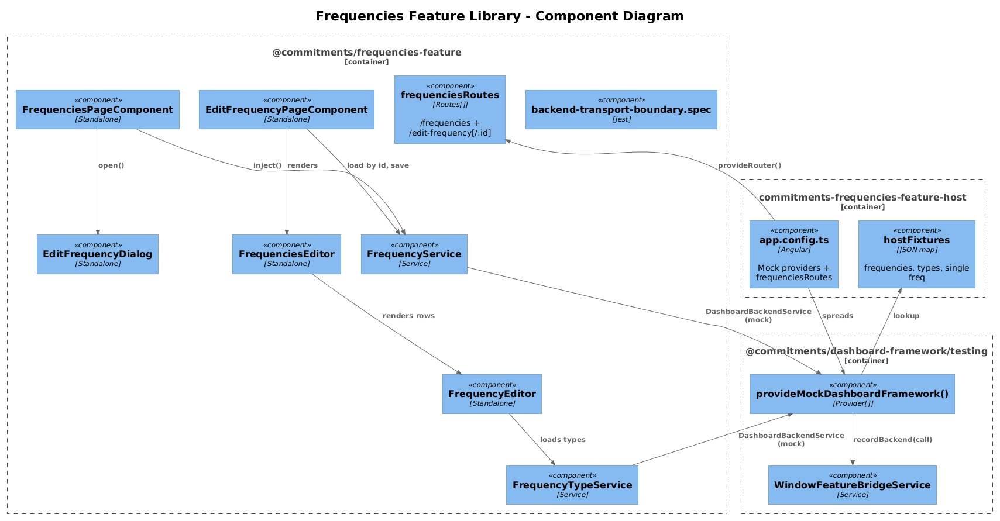
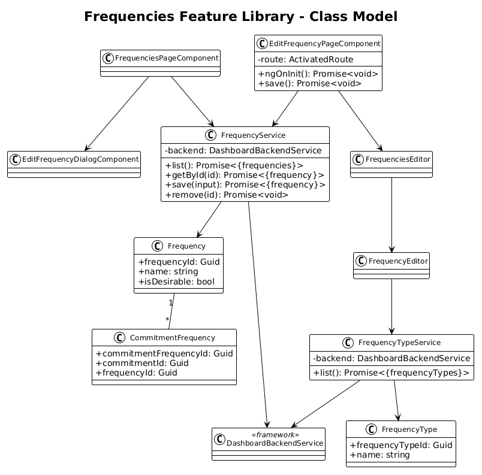
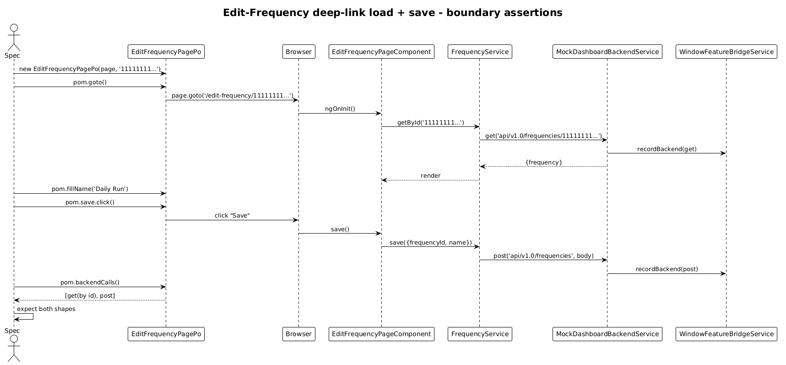

# Frequencies Feature Library — Detailed Design

**Status:** Accepted

## 1. Overview

Goal: lift the **Frequencies** catalog and the **Edit Frequency** route page out of `commitments-app/src/app/pages/` into `@commitments/frequencies-feature`, with a `commitments-frequencies-feature-host`.

Per-feature application of the [Feature Library Host Pattern](../33-feature-library-host-pattern/README.md).

**Pages:**

| Page | Route | Source |
|---|---|---|
| Frequencies | `/frequencies` | `pages/frequencies/frequencies-page` |
| Edit Frequency | `/edit-frequency`, `/edit-frequency/:frequencyId` | `pages/edit-frequency/edit-frequency-page` |

**Services moved:** `FrequencyService`, `FrequencyTypeService`, `EditFrequencyDialogService`.
**Components moved:** `EditFrequencyDialog`, `FrequencyEditor`, `FrequenciesEditor` (the embedded grid in the Edit Frequency page).

## 2. Architecture

### 2.1 C4 Component Diagram



### 2.2 Class Diagram



### 2.3 Sequence — Edit Frequency deep-link



## 3. Component Details

### 3.1 Library structure

```
frontend/projects/commitments-frequencies-feature/src/lib/
├── data/
│   ├── frequency.service.ts                 ← DashboardBackendService delegate
│   └── frequency-type.service.ts
├── pages/
│   ├── frequencies-page/
│   └── edit-frequency-page/
├── components/
│   ├── frequency-editor/
│   └── frequencies-editor/
├── dialogs/
│   ├── edit-frequency-dialog/
│   └── edit-frequency-dialog.service.ts
├── routes.ts                                 ← frequenciesRoutes
├── provide-frequencies-feature.ts            ← empty Provider[]
└── backend-transport-boundary.spec.ts
```

`frequenciesRoutes`:

```ts
export const frequenciesRoutes: Routes = [
  { path: 'frequencies',                        component: FrequenciesPageComponent },
  { path: 'edit-frequency',                     component: EditFrequencyPageComponent },
  { path: 'edit-frequency/:frequencyId',        component: EditFrequencyPageComponent }
];
```

### 3.2 Service migrations

```ts
@Injectable({ providedIn: 'root' })
export class FrequencyService {
  private readonly _backend = inject(DashboardBackendService);
  list():        Promise<{ frequencies: Frequency[] }>      { return this._backend.get('api/v1.0/frequencies'); }
  getById(id):   Promise<{ frequency: Frequency }>           { return this._backend.get(`api/v1.0/frequencies/${id}`); }
  save(input):   Promise<{ frequency: Frequency }>           { return this._backend.post('api/v1.0/frequencies', input); }
  remove(id):    Promise<void>                                { return this._backend.delete(`api/v1.0/frequencies/${id}`); }
}
```

`FrequencyTypeService` is the lookup catalog used by the editor and follows the same shape against `api/v1.0/frequencyTypes`.

### 3.3 Host bootstrap

```ts
export const appConfig: ApplicationConfig = {
  providers: [
    provideAnimations(),
    provideRouter([{ path: '', redirectTo: 'frequencies', pathMatch: 'full' }, ...frequenciesRoutes]),
    ...provideMockDashboardFramework({
      backendResponses: {
        'api/v1.0/frequencies': { frequencies: frequencyFixtures },
        'api/v1.0/frequencyTypes': { frequencyTypes: frequencyTypeFixtures },
        'api/v1.0/frequencies/11111111-1111-1111-1111-111111111111': { frequency: oneFrequencyFixture }
      }
    })
  ]
};
```

Port: **4330**.

### 3.4 Playwright POM + specs

```ts
// support/edit-frequency-page.po.ts
export class EditFrequencyPagePo extends BasePage {
  constructor(page: Page, readonly frequencyId?: string) { super(page); }
  get url() { return this.frequencyId ? `/edit-frequency/${this.frequencyId}` : `/edit-frequency`; }
  readonly nameInput = this.page.getByLabel('Name');
  readonly save      = this.page.getByRole('button', { name: 'Save' });
}
```

Specs:

- `frequencies-page.spec.ts` — initial `get api/v1.0/frequencies`, table renders fixture rows, edit row navigates to `/edit-frequency/<id>`.
- `edit-frequency-page.spec.ts` — deep-link with id triggers `get api/v1.0/frequencies/<id>` (asserted on the bridge), no-id route does not, save fires `post api/v1.0/frequencies` with the form body.

### 3.5 `commitments-app` cleanup

Three route entries swap for `...frequenciesRoutes`. Page folders, dialog, two services, and the two embedded editor components are deleted from `commitments-app`.

## 4. Data Model

`Frequency`, `FrequencyType`, `CommitmentFrequency` move from `commitments-app/src/app/models/` to the lib's `data/models/`. `CommitmentFrequency` has a back-reference to `Commitment` — represented as a `Guid` to avoid cross-feature import cycles, matching the backend pattern (per repo conventions in `MEMORY.md`).

## 5. Key Workflows

The deep-link sequence (above) is the load-then-save flow that exercises both routes. The list page's create/edit/delete share the boundary-call assertion shape.

## 6. Why "Radically Simple"

- **Two routes from one component** — `EditFrequencyPageComponent` already handles the optional `frequencyId` param. Nothing changes about the component code.
- **`FrequenciesEditor` and `FrequencyEditor` move as plain folders** — they are standalone components with no DI surprises.
- **No new validators** — the existing `FluentValidation`-driven backend errors continue to surface through the mock's `__error` fixture branch (see slice 35 §7).

## 7. Open Questions

1. **`FrequenciesEditor` cross-feature reuse.** It is currently used inside Commitments (slice 09). If Commitments still needs the editor after slice 37, the lib must export it through `public-api.ts`. Recommend exporting the component **and** a thin standalone-friendly path so the Commitments lib can import it as `@commitments/frequencies-feature`.
2. **`IsDesirable` warn chip** (slice 07). Existing UI logic; moves verbatim.

## 8. Out of Scope

- Removing the embedded grid (slice 23 ag-grid → mat-table migration).
- Moving `Commitment` itself (slice 37).
