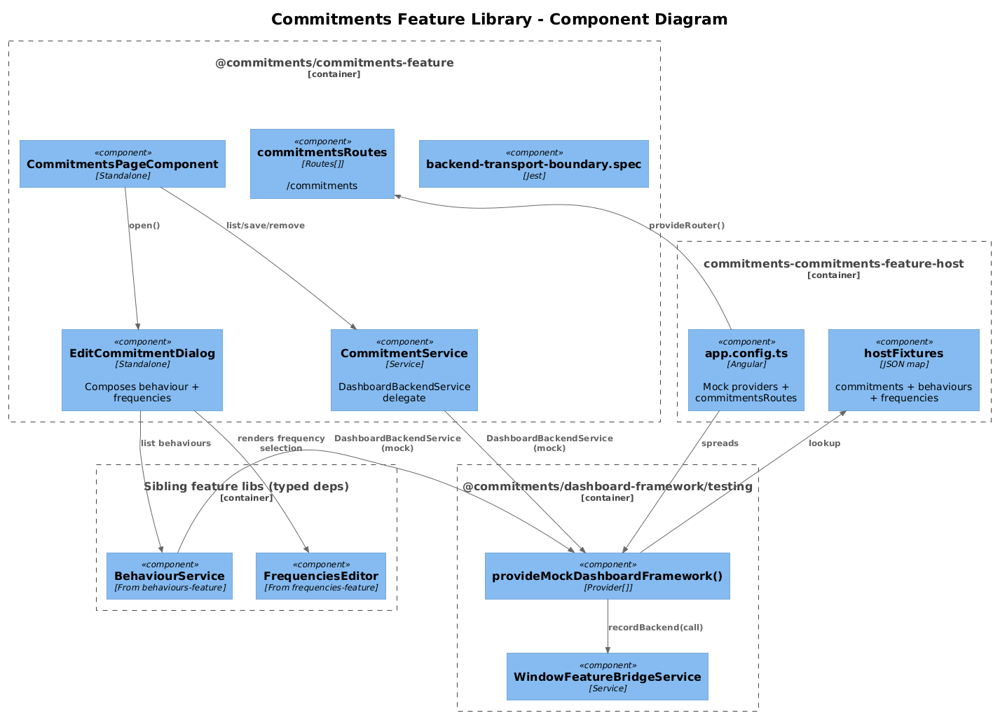
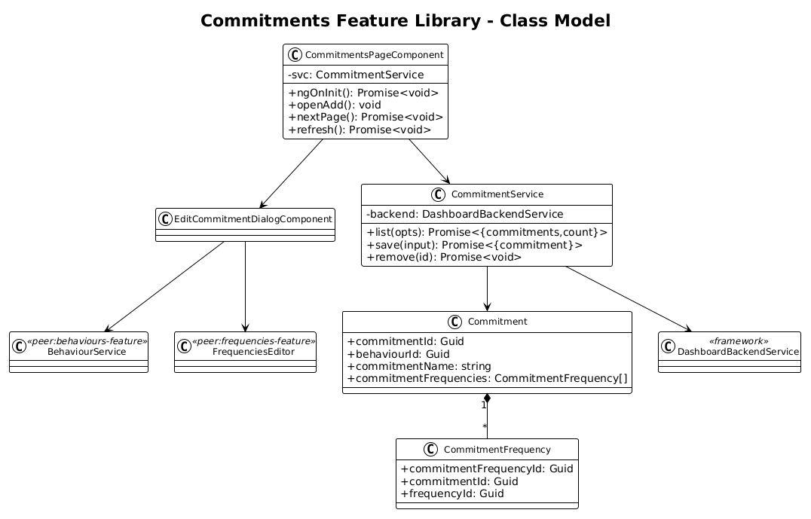
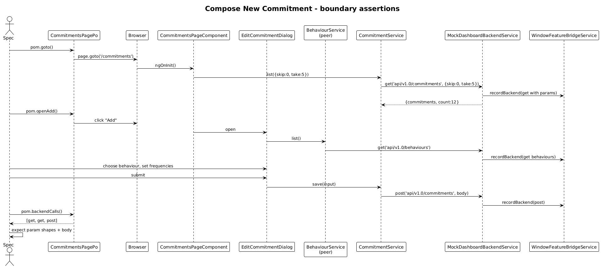

# Commitments Feature Library — Detailed Design

**Status:** Accepted

## 1. Overview

Goal: lift the **Commitments** page (the catalog of commitments with composition dialog and 5-row pagination per slice 09) out of `commitments-app` into `@commitments/commitments-feature`, with a `commitments-commitments-feature-host`.

Per-feature application of the [Feature Library Host Pattern](../33-feature-library-host-pattern/README.md).

**Pages:**

| Page | Route | Source |
|---|---|---|
| Commitments | `/commitments` | `pages/commitments/commitments-page` |

**Services moved:** `CommitmentService`, `EditCommitmentDialogService`.
**Dialogs moved:** `EditCommitmentDialog`, `EditCardDialog` (used by the composition dialog) — *see Open Questions*.

## 2. Architecture

### 2.1 C4 Component Diagram



### 2.2 Class Diagram



### 2.3 Sequence — Compose New Commitment



## 3. Component Details

### 3.1 Library structure

```
frontend/projects/commitments-commitments-feature/src/lib/
├── data/
│   └── commitment.service.ts                 ← DashboardBackendService delegate
├── pages/
│   └── commitments-page/
├── dialogs/
│   ├── edit-commitment-dialog/
│   └── edit-commitment-dialog.service.ts
├── routes.ts                                  ← commitmentsRoutes
├── provide-commitments-feature.ts             ← empty Provider[]
└── backend-transport-boundary.spec.ts
```

`commitmentsRoutes`:

```ts
export const commitmentsRoutes: Routes = [
  { path: 'commitments', component: CommitmentsPageComponent }
];
```

### 3.2 Service migration

```ts
@Injectable({ providedIn: 'root' })
export class CommitmentService {
  private readonly _backend = inject(DashboardBackendService);
  list(): Promise<{ commitments: Commitment[] }>    { return this._backend.get('api/v1.0/commitments'); }
  save(input): Promise<{ commitment: Commitment }>  { return this._backend.post('api/v1.0/commitments', input); }
  remove(id):  Promise<void>                        { return this._backend.delete(`api/v1.0/commitments/${id}`); }
}
```

The composition dialog needs `Behaviour` and `Frequency` lookups; those are obtained via cross-feature service injection from `@commitments/behaviours-feature` and `@commitments/frequencies-feature`. The library declares those as `peerDependencies`.

### 3.3 Host bootstrap

```ts
export const appConfig: ApplicationConfig = {
  providers: [
    provideAnimations(),
    provideRouter([{ path: '', redirectTo: 'commitments', pathMatch: 'full' }, ...commitmentsRoutes]),
    ...provideMockDashboardFramework({
      backendResponses: {
        'api/v1.0/commitments':       { commitments: commitmentFixtures },
        'api/v1.0/behaviours':        { behaviours: behaviourFixtures },
        'api/v1.0/frequencies':       { frequencies: frequencyFixtures },
        'api/v1.0/frequencyTypes':    { frequencyTypes: frequencyTypeFixtures }
      }
    })
  ]
};
```

Port: **4340**.

### 3.4 Playwright POM + specs

```ts
// support/commitments-page.po.ts
export class CommitmentsPagePo extends BasePage {
  readonly url       = '/commitments';
  readonly rows      = this.page.getByRole('row');
}
```

Spec (single `commitments-page.spec.ts`):

- Asserts initial `get api/v1.0/commitments` on load.
- Asserts table renders one row per fixture commitment.
- All assertions read from `pom.backendCalls()`.

### 3.5 `commitments-app` cleanup

Two-line route swap. Page folder, dialog, dialog service, and `commitment.service.ts` deleted.

## 4. Data Model

`Commitment`, `CommitmentFrequency` move with the lib. `CommitmentFrequency.frequencyId` and `Commitment.behaviourId` remain as `Guid` references (no nav properties), per repo convention. The lib *imports* the `Frequency` and `Behaviour` model types from the sibling feature libraries for typing only.

## 5. Key Workflows

The compose-new-commitment sequence (above) is the canonical flow. Pagination, edit, and delete are list-page variants of the same boundary-call assertion.

## 6. Why "Radically Simple"

- **One page, one service, one dialog.** Smallest non-trivial slice.
- **Cross-feature deps stay typed-only.** Behaviour/Frequency picker inside the composition dialog uses the `*Service` from the sibling lib, but the *runtime* path is the mock `DashboardBackendService` — so pulling the dialog into the host needs no special wiring beyond the standard mock providers.

## 7. Open Questions

1. **Where does `EditCardDialog` live?** It is currently used both by the commitments page (rendering tracking cards) and the cards page. Recommend: stays in slice 40 (`cards-feature`) and is imported by `commitments-feature` via the public-api.
2. **Realtime invalidation** — when an Activity is recorded, the commitments grid needs to re-fetch. Today this is done via `hub-client`. Until a `DashboardRealtimeService` ships in the framework, the lib does **not** subscribe to hub events; the commitments-app continues to wrap the lib component with a hub-driven refresh trigger. The lib exposes a `refresh()` method on the page component for this purpose.
3. **5-row pagination** — fixed to 5 in the spec; the lib stays with the existing `MatPaginator` config.

## 8. Out of Scope

- Realtime hub re-fetch (waits on `DashboardRealtimeService`).
- ag-grid → mat-table presentation (slice 20).
