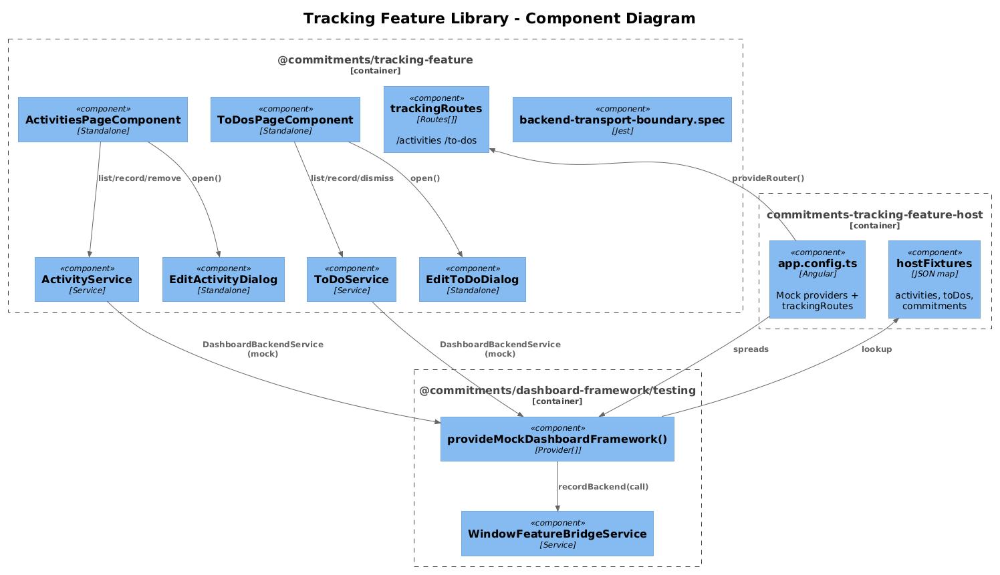
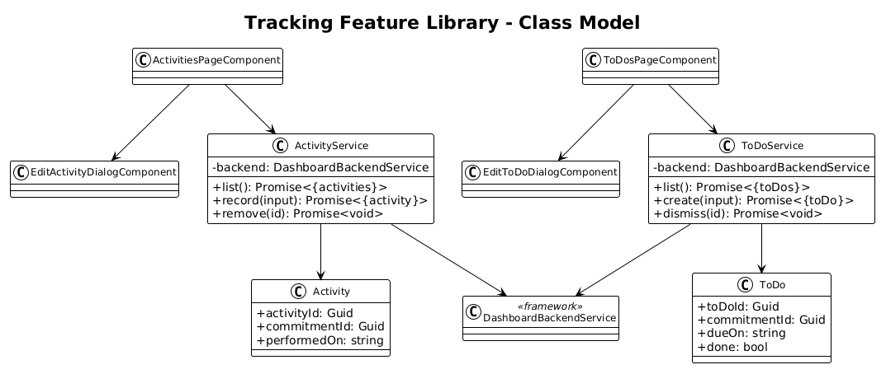
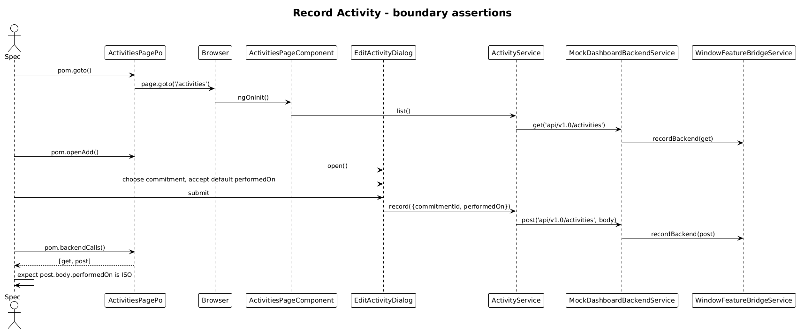

# Tracking Feature Library — Detailed Design

**Status:** Complete

## 1. Overview

Goal: lift the **Activities** and **To-Dos** pages out of `commitments-app` into `@commitments/tracking-feature`, with a `commitments-tracking-feature-host`.

Per-feature application of the [Feature Library Host Pattern](../33-feature-library-host-pattern/README.md).

These two pages share a "tracking" bounded context — both record user actions over time against a `Commitment` and read back through the commitment grid (commitment-related re-fetch logic stays in slice 37).

**Pages:**

| Page | Route | Source |
|---|---|---|
| Activities | `/activities` | `pages/activities/activities-page` |
| To-Dos     | `/to-dos`     | `pages/to-dos/to-dos-page` |

**Services moved:** `ActivityService`, `ToDoService`, `EditActivityDialogService`, `EditToDoDialogService`.
**Dialogs moved:** `EditActivityDialog`, `EditToDoDialog`.

## 2. Architecture

### 2.1 C4 Component Diagram



### 2.2 Class Diagram



### 2.3 Sequence — Record Activity



## 3. Component Details

### 3.1 Library structure

```
frontend/projects/commitments-tracking-feature/src/lib/
├── data/
│   ├── activity.service.ts
│   └── to-do.service.ts
├── pages/
│   ├── activities-page/
│   └── to-dos-page/
├── dialogs/
│   ├── edit-activity-dialog/
│   ├── edit-activity-dialog.service.ts
│   ├── edit-to-do-dialog/
│   └── edit-to-do-dialog.service.ts
├── routes.ts                                ← trackingRoutes
├── provide-tracking-feature.ts              ← empty Provider[]
└── backend-transport-boundary.spec.ts
```

`trackingRoutes`:

```ts
export const trackingRoutes: Routes = [
  { path: 'activities', component: ActivitiesPageComponent },
  { path: 'to-dos',     component: ToDosPageComponent }
];
```

### 3.2 Service migrations

```ts
@Injectable({ providedIn: 'root' })
export class ActivityService {
  private readonly _backend = inject(DashboardBackendService);
  list():        Promise<{ activities: Activity[] }> { return this._backend.get('api/v1.0/activities'); }
  record(input): Promise<{ activity: Activity }>     { return this._backend.post('api/v1.0/activities', input); }
  remove(id):    Promise<void>                       { return this._backend.delete(`api/v1.0/activities/${id}`); }
}
```

`ToDoService` mirrors against `api/v1.0/toDos`. The "Add To-Do" dialog defaults `dueOn` to "now" — **no time logic** in the lib; the dialog just `new Date()`s on open. Spec asserts the `post` body has a non-null `dueOn`.

### 3.3 Host bootstrap

```ts
export const appConfig: ApplicationConfig = {
  providers: [
    provideAnimations(),
    provideRouter([{ path: '', redirectTo: 'activities', pathMatch: 'full' }, ...trackingRoutes]),
    ...provideMockDashboardFramework({
      backendResponses: {
        'api/v1.0/activities':  { activities: activityFixtures },
        'api/v1.0/toDos':       { toDos: toDoFixtures },
        'api/v1.0/commitments': { commitments: commitmentFixtures }
      }
    })
  ]
};
```

Port: **4350**.

### 3.4 Playwright POM + specs

```ts
// support/activities-page.po.ts
export class ActivitiesPagePo extends BasePage {
  readonly url = '/activities';
  readonly addButton = this.page.getByRole('button', { name: 'Add Activity' });
  readonly rows      = this.page.getByRole('row');
}
```

Specs:

- `activities-page.spec.ts` — initial `get api/v1.0/activities`, add records `post api/v1.0/activities` with `{ commitmentId, performedOn }`, body's `performedOn` is an ISO string.
- `to-dos-page.spec.ts` — same shape against `api/v1.0/toDos`, asserts `dueOn` defaulting in the post body.

### 3.5 `commitments-app` cleanup

Two route entries swap. Page folders, two services, two dialogs, two dialog services deleted.

## 4. Data Model

`Activity` and `ToDo` move with the lib. Each carries a `commitmentId: Guid` reference, no nav property.

## 5. Key Workflows

The Record Activity sequence above is canonical. Dismiss-To-Do (mark done) follows the same `post`/`put` shape and a single bridge assertion.

## 6. Why "Radically Simple"

- **No domain logic in the lib.** Both pages are list + dialog + post. Time defaults are inline `new Date()` calls in the dialog component.
- **No cross-feature cycles.** The pages reference `Commitment` only via `commitmentId: Guid` and a static dropdown loaded from `api/v1.0/commitments`.

## 7. Open Questions

1. **Outstanding-to-do count** — currently surfaced as a tile through `commitments-dashboard-plugin`. That tile's data service stays in the plugin lib (it already uses `DashboardBackendService`); this slice doesn't touch it.
2. **`PerformedOn` defaulting** — kept inline in the dialog. If multiple features later need "default-to-now", a `nowProvider()` token in `dashboard-framework/testing` would let specs deterministically advance time. Out of scope until needed.

## 8. Out of Scope

- Tracking tile presentation — owned by the dashboard plugin.
- Realtime invalidation of the activities grid (waits on `DashboardRealtimeService`).
