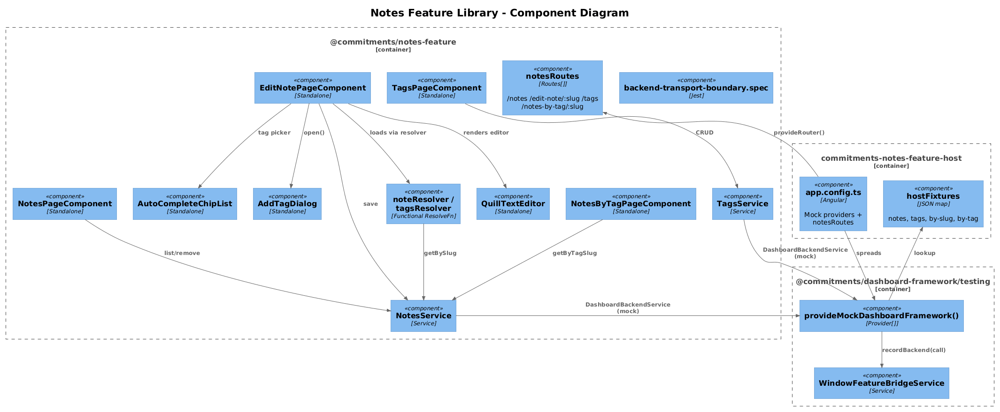
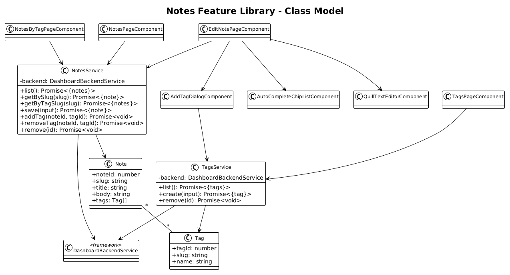
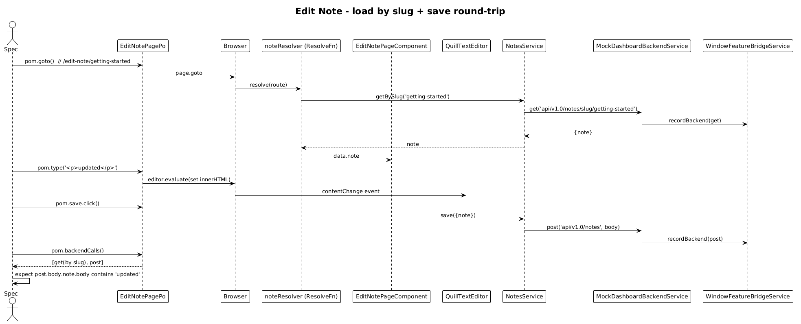

# Notes Feature Library — Detailed Design

**Status:** Draft

## 1. Overview

Goal: lift the **Notes**, **Edit Note**, **Tags**, and **Notes by Tag** pages — plus the `AddTagDialog` and the `AutoCompleteChipList` component — out of `commitments-app` into `@commitments/notes-feature`, with a `commitments-notes-feature-host`.

Per-feature application of the [Feature Library Host Pattern](../33-feature-library-host-pattern/README.md). This is the **largest** of the eight per-feature slices because Notes is a fully-formed domain (Notes ⟷ Tags many-to-many, slug routing, Quill editor).

**Pages:**

| Page | Route | Source |
|---|---|---|
| Notes         | `/notes`               | `pages/notes/notes-page` |
| Edit Note     | `/edit-note/:slug`     | `pages/edit-note/edit-note-page` |
| Tags          | `/tags`                | `pages/tags/tags-page` |
| Notes by Tag  | `/notes-by-tag/:slug`  | `pages/notes-by-tag/notes-by-tag-page` |

**Services moved:** `NotesService`, `TagsService`, `noteResolver`, `tagsResolver`, `note-resolver.service`, `tags-resolver.service`.
**Components moved:** `QuillTextEditorComponent`, `AutoCompleteChipList`, `AddTagDialog`.

## 2. Architecture

### 2.1 C4 Component Diagram



### 2.2 Class Diagram



### 2.3 Sequence — Edit Note Save Round-Trip



## 3. Component Details

### 3.1 Library structure

```
frontend/projects/commitments-notes-feature/src/lib/
├── data/
│   ├── notes.service.ts
│   ├── tags.service.ts
│   ├── note-resolver.service.ts             ← functional resolver returning Promise<Note>
│   └── tags-resolver.service.ts
├── pages/
│   ├── notes-page/
│   ├── edit-note-page/
│   ├── tags-page/
│   └── notes-by-tag-page/
├── components/
│   ├── quill-text-editor/
│   └── auto-complete-chip-list/
├── dialogs/
│   └── add-tag-dialog/
├── routes.ts                                 ← notesRoutes
├── provide-notes-feature.ts                  ← empty Provider[]
└── backend-transport-boundary.spec.ts
```

`notesRoutes`:

```ts
export const notesRoutes: Routes = [
  { path: 'notes',                 component: NotesPageComponent },
  { path: 'edit-note/:slug',       component: EditNotePageComponent, resolve: { note: noteResolver } },
  { path: 'tags',                  component: TagsPageComponent },
  { path: 'notes-by-tag/:slug',    component: NotesByTagPageComponent }
];
```

### 3.2 Service migrations

```ts
@Injectable({ providedIn: 'root' })
export class NotesService {
  private readonly _backend = inject(DashboardBackendService);
  list():                                Promise<{ notes: Note[] }>      { return this._backend.get('api/v1.0/notes'); }
  getBySlug(slug: string):               Promise<{ note: Note }>          { return this._backend.get(`api/v1.0/notes/slug/${slug}`); }
  getByTagSlug(slug: string):            Promise<{ notes: Note[] }>       { return this._backend.get(`api/v1.0/notes/tag/${slug}`); }
  save(input: { note: Note }):           Promise<{ note: Note }>          { return this._backend.post('api/v1.0/notes', input); }
  addTag(noteId: number, tagId: number): Promise<void>                    { return this._backend.post(`api/v1.0/notes/${noteId}/tag/${tagId}`, {}); }
  removeTag(noteId: number, tagId: number): Promise<void>                 { return this._backend.post(`api/v1.0/notes/${noteId}/removeTag`, { tagId }); }
  remove(id: number):                    Promise<void>                    { return this._backend.delete(`api/v1.0/notes/${id}`); }
}
```

`TagsService` mirrors against `api/v1.0/tags`. The Angular `Resolve` interfaces are converted to functional resolvers (`noteResolver: ResolveFn<Note>`) returning a `Promise` so they compose cleanly with the new service shape.

### 3.3 Host bootstrap

```ts
export const appConfig: ApplicationConfig = {
  providers: [
    provideAnimations(),
    provideRouter([{ path: '', redirectTo: 'notes', pathMatch: 'full' }, ...notesRoutes]),
    ...provideMockDashboardFramework({
      backendResponses: {
        'api/v1.0/notes':                        { notes: noteFixtures },
        'api/v1.0/tags':                         { tags: tagFixtures },
        'api/v1.0/notes/slug/getting-started':   { note: oneNoteFixture },
        'api/v1.0/notes/tag/work':               { notes: noteFixtures.filter(n => n.tags.includes('work')) }
      }
    })
  ]
};
```

Port: **4360**.

### 3.4 Playwright POM + specs

```ts
// support/edit-note-page.po.ts
export class EditNotePagePo extends BasePage {
  constructor(page: Page, readonly slug: string) { super(page); }
  get url() { return `/edit-note/${this.slug}`; }
  readonly title    = this.page.getByLabel('Title');
  readonly editor   = this.page.locator('[data-testid="quill-editor"] .ql-editor');
  readonly save     = this.page.getByRole('button', { name: 'Save' });
  async type(html: string) { await this.editor.click(); await this.editor.evaluate((el, h) => (el.innerHTML = h), html); }
}
```

Specs (one per page):

- `notes-page.spec.ts` — initial `get api/v1.0/notes`, click row navigates to `/edit-note/<slug>`, deletion fires `delete`.
- `edit-note-page.spec.ts` — slug deep-link triggers `get api/v1.0/notes/slug/<slug>`, save fires `post api/v1.0/notes` with the body containing the typed HTML.
- `tags-page.spec.ts` — list + create + remove tag boundary calls.
- `notes-by-tag-page.spec.ts` — `get api/v1.0/notes/tag/<slug>`, click navigates to edit-note.

### 3.5 `commitments-app` cleanup

Four route entries swap. Page folders, two services, two resolvers, three components, `AddTagDialog` deleted from `commitments-app`. The `Note` and `Tag` models move to the lib's `data/models/`.

## 4. Data Model

### 4.1 Entities

| Entity | Key fields | Reference |
|---|---|---|
| `Note`  | `noteId: number`, `slug: string`, `title: string`, `body: string` (HTML, sanitised at write) | Slice 12, 13 |
| `Tag`   | `tagId: number`, `slug: string`, `name: string`                                              | Slice 14 |
| `NoteTag` join | server-side; surfaced via `addTag`/`removeTag` endpoints                                  | Slice 15 |

### 4.2 Slug strategy

Slug routing is preserved verbatim. Resolvers return a `Promise<Note>` and reject with the same shape `commitments-app` uses today (so the existing 404 redirect still works inside the host once `commitments-app` re-imports the lib).

## 5. Key Workflows

The Edit Note save round-trip (above) is the canonical flow. Adding a tag from the Add Tag Dialog is a smaller variant — POM clicks "Add Tag", picks a tag from the chip list, asserts a `post api/v1.0/notes/<noteId>/tag/<tagId>` on the bridge.

## 6. Why "Radically Simple"

- **Resolver becomes a function.** `noteResolver: ResolveFn<Note>` is six lines vs. a class — the new shape lines up better with the Promise-returning service.
- **Quill is a black box.** The editor component moves verbatim. Specs interact via `[data-testid]` hooks, not Quill internals.
- **Tags page is plain CRUD.** No special inline-edit ag-grid hack inside the lib (slice 21 owns that migration separately).

## 7. Open Questions

1. **Body sanitisation.** Slice 13 puts HTML sanitisation at the API. The lib calls the API; nothing changes here.
2. **Quill peerDep size.** Quill weighs ~270kb. Each host now bundles it. Acceptable cost — host bundles are dev-only test harnesses.
3. **`AutoCompleteChipList` reuse.** Currently used here and (planned) in the Cards page composition. If Cards needs it, the lib exports it via `public-api.ts` and the cards lib imports it as a peer. Recommend doing that import inside slice 40 rather than promoting the chip list to a separate lib.

## 8. Out of Scope

- ag-grid → mat-table migration of the Notes table (slice 22) and Tags inline edit (slice 21).
- Search across notes (no search feature exists today).
