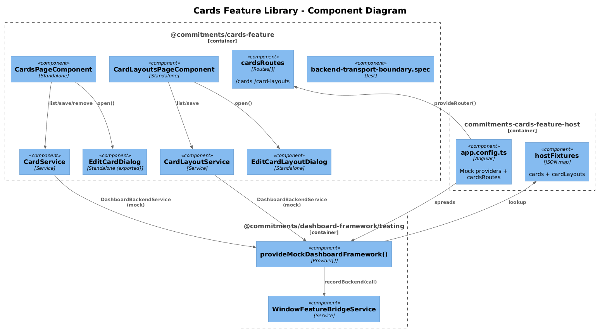
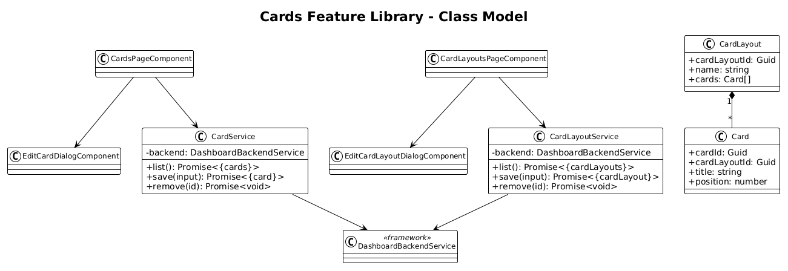
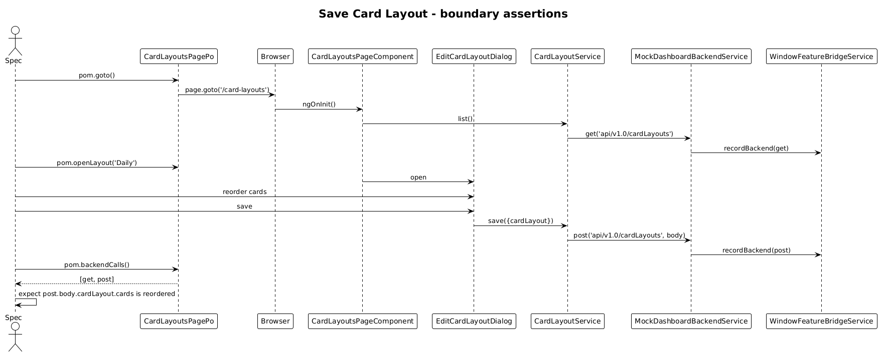

# Cards Feature Library — Detailed Design

**Status:** Draft

## 1. Overview

Goal: lift the **Cards** and **Card Layouts** pages out of `commitments-app` into `@commitments/cards-feature`, with a `commitments-cards-feature-host`.

Per-feature application of the [Feature Library Host Pattern](../33-feature-library-host-pattern/README.md).

**Pages:**

| Page | Route | Source |
|---|---|---|
| Cards         | `/cards`         | `pages/cards/cards-page` |
| Card Layouts  | `/card-layouts`  | `pages/card-layouts/card-layouts-page` |

**Services moved:** `CardService`, `CardLayoutService`, `EditCardDialogService`, `EditCardLayoutDialogService`.
**Dialogs moved:** `EditCardDialog`, `EditCardLayoutDialog`.

`EditCardDialog` is also consumed by the Commitments page (see slice 37 §7). This lib exports it through `public-api.ts` so the commitments-feature can import it as a peer.

## 2. Architecture

### 2.1 C4 Component Diagram



### 2.2 Class Diagram



### 2.3 Sequence — Save Card Layout



## 3. Component Details

### 3.1 Library structure

```
frontend/projects/commitments-cards-feature/src/lib/
├── data/
│   ├── card.service.ts
│   └── card-layout.service.ts
├── pages/
│   ├── cards-page/
│   └── card-layouts-page/
├── dialogs/
│   ├── edit-card-dialog/
│   ├── edit-card-dialog.service.ts
│   ├── edit-card-layout-dialog/
│   └── edit-card-layout-dialog.service.ts
├── routes.ts                                ← cardsRoutes
├── provide-cards-feature.ts                 ← empty Provider[]
└── backend-transport-boundary.spec.ts
```

`cardsRoutes`:

```ts
export const cardsRoutes: Routes = [
  { path: 'cards',         component: CardsPageComponent },
  { path: 'card-layouts',  component: CardLayoutsPageComponent }
];
```

### 3.2 Service migrations

```ts
@Injectable({ providedIn: 'root' })
export class CardService {
  private readonly _backend = inject(DashboardBackendService);
  list():        Promise<{ cards: Card[] }>     { return this._backend.get('api/v1.0/cards'); }
  save(input):   Promise<{ card: Card }>         { return this._backend.post('api/v1.0/cards', input); }
  remove(id):    Promise<void>                   { return this._backend.delete(`api/v1.0/cards/${id}`); }
}
```

`CardLayoutService` mirrors against `api/v1.0/cardLayouts`. The layout dialog persists positions for a layout's cards in one body.

### 3.3 Host bootstrap

```ts
export const appConfig: ApplicationConfig = {
  providers: [
    provideAnimations(),
    provideRouter([{ path: '', redirectTo: 'cards', pathMatch: 'full' }, ...cardsRoutes]),
    ...provideMockDashboardFramework({
      backendResponses: {
        'api/v1.0/cards':       { cards: cardFixtures },
        'api/v1.0/cardLayouts': { cardLayouts: cardLayoutFixtures }
      }
    })
  ]
};
```

Port: **4370**.

### 3.4 Playwright POM + specs

- `cards-page.spec.ts` — `get api/v1.0/cards`, edit row triggers `post` with the dialog body.
- `card-layouts-page.spec.ts` — `get api/v1.0/cardLayouts`, save layout triggers `post api/v1.0/cardLayouts` with the array of card positions.

### 3.5 `commitments-app` cleanup

Two route entries swap. Page folders, two services, two dialogs, two dialog services deleted.

## 4. Data Model

`Card`, `CardLayout` move with the lib. Each `Card` belongs to a layout via `cardLayoutId: Guid`.

## 5. Key Workflows

The Save Card Layout sequence (above) is the canonical flow. Card CRUD is a list+dialog variant of the standard boundary-call assertion.

## 6. Why "Radically Simple"

- **No drag-and-drop logic in this slice.** If layout editing uses the existing CDK drag helper, it moves verbatim. The bridge assertion is on the *resulting save body*, not on the drag interaction itself.
- **Smallest surface area outside identity.** Two list pages, two dialogs.

## 7. Open Questions

1. **`EditCardDialog` shared with Commitments.** Lib exports it via public-api. Both commitments-feature and cards-feature host apps include it in their fixtures.
2. **Card preview rendering.** If a card preview needs the dashboard framework's tile registry, it stays unrenderable inside the host (the mock `TileRegistry` returns no tiles). Spec asserts on the *form data*, not on the preview.

## 8. Out of Scope

- Real dashboard composition (delegated to dashboard-framework + plugin).
- ag-grid → mat-table migration of these pages (slice 19).
