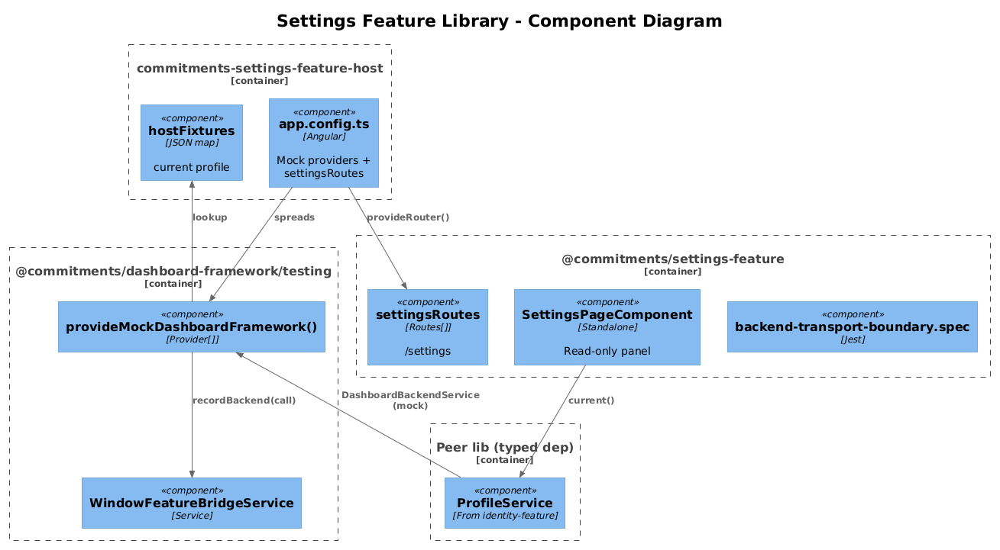
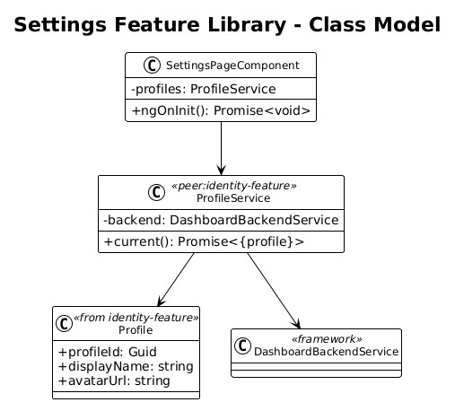
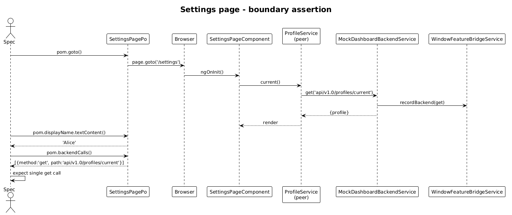

# Settings Feature Library — Detailed Design

**Status:** Complete

## 1. Overview

Goal: lift the **Settings** page out of `commitments-app` into `@commitments/settings-feature`, with a `commitments-settings-feature-host`. This is the smallest of the eight feature slices and the last in the extraction order — it depends on every other library being in place because the Settings page deep-links to the other feature routes.

Per-feature application of the [Feature Library Host Pattern](../33-feature-library-host-pattern/README.md).

**Pages:**

| Page | Route | Source |
|---|---|---|
| Settings | `/settings` | `pages/settings/settings-page` |

**Services moved:** none (the page reads `Profile` from the existing `ProfileService` in `@commitments/identity-feature` — typed peer dep) and a small `version` constant.

## 2. Architecture

### 2.1 C4 Component Diagram



### 2.2 Class Diagram



### 2.3 Sequence — Settings Page Reads Current Profile



## 3. Component Details

### 3.1 Library structure

```
frontend/projects/commitments-settings-feature/src/lib/
├── pages/
│   └── settings-page/
├── routes.ts                                ← settingsRoutes
├── provide-settings-feature.ts              ← empty Provider[]
└── backend-transport-boundary.spec.ts
```

`settingsRoutes`:

```ts
export const settingsRoutes: Routes = [
  { path: 'settings', component: SettingsPageComponent }
];
```

### 3.2 No new services

The page injects `ProfileService` from `@commitments/identity-feature` directly. No new HTTP. No new entity. The page renders a read-only profile + version panel (per slice 04). The boundary spec still applies — `commitments-settings-feature` must contain zero `HttpClient` references.

### 3.3 Host bootstrap

```ts
export const appConfig: ApplicationConfig = {
  providers: [
    provideAnimations(),
    provideRouter([{ path: '', redirectTo: 'settings', pathMatch: 'full' }, ...settingsRoutes]),
    ...provideMockDashboardFramework({
      backendResponses: {
        'api/v1.0/profiles/current': { profile: oneProfileFixture }
      }
    })
  ]
};
```

Port: **4380**.

### 3.4 Playwright POM + spec

```ts
// support/settings-page.po.ts
export class SettingsPagePo extends BasePage {
  readonly url = '/settings';
  readonly displayName = this.page.getByTestId('settings-display-name');
  readonly version     = this.page.getByTestId('settings-version');
}
```

Single spec (`settings-page.spec.ts`) — asserts:

1. Page renders fixture profile's display name.
2. `version` element renders a non-empty string.
3. `pom.backendCalls()` has exactly one entry: `get api/v1.0/profiles/current`.

That third assertion is the boundary contract — even a "static read-only page" still runs through `DashboardBackendService` and is verifiable.

### 3.5 `commitments-app` cleanup

One route entry swap. Page folder deleted.

## 4. Data Model

No new entities. `Profile` model is consumed from `@commitments/identity-feature`.

## 5. Key Workflows

The single read-current-profile sequence (above) is the only flow.

## 6. Why "Radically Simple"

- **Zero services in the lib.** Only a page component and a routes export.
- **Single spec, three assertions.** Lowest possible bar that still proves boundary correctness.
- **Drop-in replacement.** `commitments-app` swaps one line in `app.routes.ts`.

## 7. Open Questions

1. **Version constant** — currently a hard-coded string in `commitments-app/src/app/core/constants.ts`. Recommend: move to `@commitments/dashboard-framework` as `APP_VERSION` injection token, and the host overrides it with `'host'`. One-line change.
2. **Cross-feature deep-links** — Settings has links to other features. Inside the host the linked routes don't exist (each host hosts one library). Recommend: render the deep-links as plain `<a>` tags with `data-testid` so the spec asserts on `href` rather than triggering a navigation. No router-link processing needed.

## 8. Out of Scope

- Editable settings (none today).
- Theme switching, language toggling — owned elsewhere.
